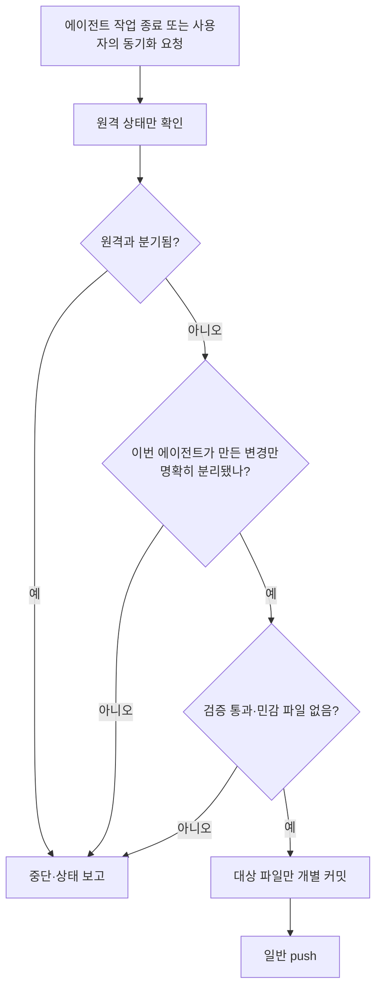

# 260718_agentic-ai-platform-optimization

Claude Code / Codex / Antigravity 세 플랫폼의 최적화·유지관리 워크스페이스.
플랫폼별 작업은 `claude/`, `codex/`, `antigravity/` 폴더에서 관리한다.

## Skill 분류 원칙

- Skill 정본, 후보, 플러그인 패키지, 평가 근거는 모두 `skills/` 아래에서 관리한다.
- 윤겸스가 직접 설계·소유하는 MIA 시리즈는 `skills/custom/mia/`에 둔다.
- 외부에서 가져와 정제하는 Skill은 `skills/external/<publisher>/<skill-name>/`에 두고
  `SOURCE.md`에 원본, 라이선스, 버전, 변경 이력을 기록한다.
- `shared/`나 플랫폼 폴더에 Skill 정본을 중복 배치하지 않는다. 이전 경로는 평가·이관
  증거의 `historical_path`로만 보존한다.

## 저장소 동기화 원칙

- **상시 자동 동기화 (2026-07-20 상시 위임)**: 이 워크스페이스에서 파일을 변경하면,
  별도 지시가 없어도 작업 마무리 시 검증 → 커밋 → `git push`까지 자동 수행해 GitHub
  원격(main)과 동기 상태를 유지한다. push는 이 저장소에 한해 상시 승인된 것으로 본다.
  단, 아래 **SAFE-SYNC 게이트를 통과한 변경만** 자동으로 올린다.

### SAFE-SYNC 게이트 (정본 순서도)

원치 않는 파일의 외부 유출을 막기 위한 안전 로직. 핵심 원칙:
**`git add -A`·`git add .`로 싹 담지 않는다. 이번 에이전트가 만든 변경만 명시적 경로로 담는다.**
아래 순서도가 정본이며, 어느 판단이든 애매하면 **push가 아니라 중단·보고**로 간다.

- **B 원격 상태만 확인**: `git fetch` 후 로컬↔원격 위치만 본다. 아직 아무것도 스테이징·커밋하지 않는다.
- **C 분기 판정**: 원격이 로컬보다 앞서거나 갈라졌으면(`origin/main..HEAD`와 반대가 함께 있으면)
  **중단·보고**. 자동 `pull --rebase`·merge·`--force`로 밀어붙이지 않는다.
- **D 변경 분리**: `git status --porcelain`로 열거 → ⓐ 이번 에이전트가 만든 것 / ⓑ 그 외(다른
  세션·린터·사용자 직접 편집·정체불명). ⓑ가 섞여 분리가 불명확하면 **중단·보고**. ⓐ만 경로로 명시 스테이징.
- **E 검증·민감 판정**: `npm run check`(있으면) 통과 + 스테이징 diff에 비밀정보(토큰·키·쿠키·`.env`)·
  머신 로컬 설정·대용량 바이너리가 없어야 통과. 하나라도 걸리면 **중단·보고**.
- **F 개별 커밋**: 의미 단위로 나눠 Conventional Commits. **G 일반 push**(force 아님).

- 커밋 안 된 변경이나 미푸시 커밋을 세션 끝에 남기지 않는다. 단, 게이트에 걸려 **보류한 항목**은
  "왜 보류했는지"와 함께 보고하는 것으로 갈음한다(억지로 올리지 않는다).
- **절대 자동 커밋 금지(하드 제외)**: 게이트 통과 여부와 무관하게 아래는 올리지 않는다 —
  비밀정보(`.env`·키·토큰·쿠키), 머신 고유 로컬 설정(`.claude/settings.local.json`·
  `.agents/config.json`·`.agents/mcp_config.json` 등), 대용량 바이너리·빌드 산출물·
  `node_modules`·로그·캐시. (이미 추적 중인 머신 로컬 파일의 변경도 자동 push 대상이 아니다.)
- **동기화 범위 밖(별도 승인 필요)**: 전역 Skill 설치, 배포, 계정·권한·외부 서비스 변경,
  다른 저장소로의 push는 상시 위임에 포함되지 않는다. 영향과 복구 방법을 설명한 뒤
  개별 승인을 받는다. `git push --force`·히스토리 재작성 등 되돌리기 어려운 작업도 별도 승인.

## NotebookLM MCP 운영 수칙

이 워크스페이스에는 `notebooklm-mcp` MCP 서버(jacob-bd/notebooklm-mcp-cli, 쿠키+내부 API 방식)가
세 플랫폼 공용으로 연결되어 있다. MCP 관련 자료는 모두 `mcp/` 섹션에서 관리한다.
상세 설계: `mcp/notebooklm/MIA_NOTEBOOKLM_MCP_OPTIMIZATION_2026-07-19.md`

- **캐시 우선**: NotebookLM에 질의하기 전에 `mcp/notebooklm/research-vault/`를 먼저 검색하고,
  새 답변은 그 폴더의 `README.md` 형식으로 저장한다. (무료 쿼터 50쿼리/일)
- **적재적소**: 로컬 파일은 직접 읽는다. NotebookLM은 외부 문서 코퍼스 질의,
  웹 리서치 축적, 오디오/비디오 생성에만 사용한다.
- **인증 만료 시** (2~4주 주기): `nlm login` 재실행. 이 PC는 Chrome이 RUNASADMIN
  플래그라 실행 불가 → `auth.browser=edge` 설정 유지 (Edge로 로그인).
- **파손 시 복구 순서**: ① `nlm login` 재실행 → ② `uv tool upgrade notebooklm-mcp-cli`
  → ③ 예비 서버(PleasePrompto `npx notebooklm-mcp@latest`)로 전환.
- **업그레이드 주의**: NotebookLM UI/API 개편 뉴스 후 24~72시간 기다렸다가 업그레이드.
