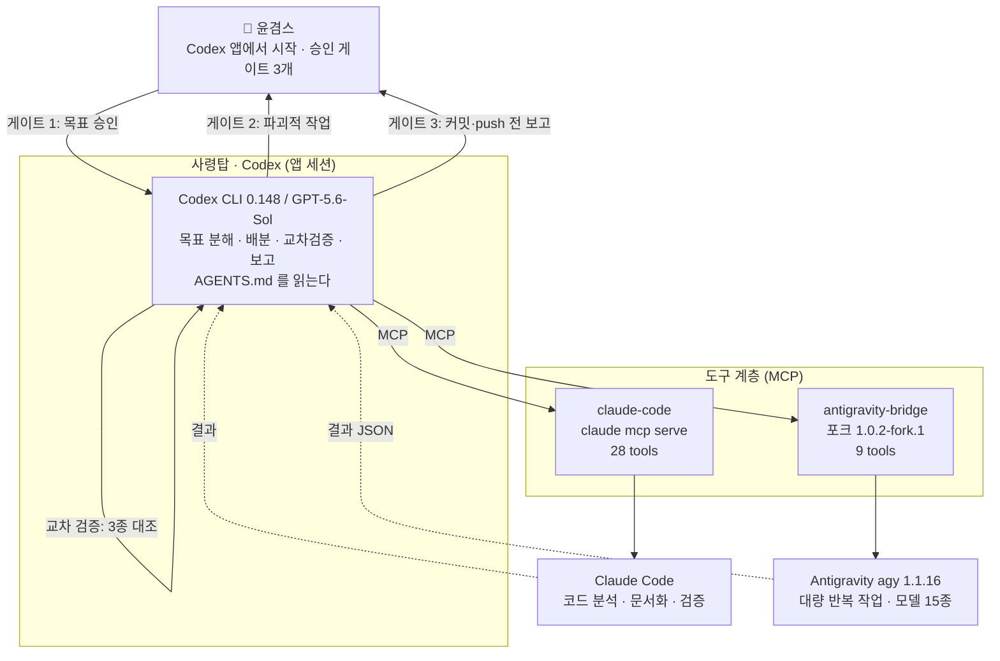

# 시스템 설계계획 — Codex 사령탑 3대 도구 병렬 운용

> **작성일**: 2026-08-21
> **스킬**: MIA 전략절차 — 기획 → 검토 → 실행 → 검증
> **선행 근거**: [통합 보고서](AGENT_SWARM_INTEGRATED_REPORT_2026-08-20.md) · [실험 로그 5건](logs/) · [소스 감사](audits/2026-08-21_mcp-server-google-antigravity.md)
> **결정 과제**: ① 이 세션을 무엇이라 부를 것인가 ② "스킬이냐 글로벌 룰이냐 플러그인이냐"에 답한다 ③ Codex를 사령탑으로 Claude Code·Antigravity를 직접 제어하는 시스템을 설계한다

---

## 0. 세션 명명

이 세션에서 실제로 일어난 일은 "3대 도구 연동 조사"가 아니다. **바이럴로 돈 기법 3건을 실측으로 검증했더니 두 번 뒤집혔고, 그 끝에 지휘 구조가 바뀐 것**이다. 이름은 그 축을 담아야 한다.

| 후보 | 근거 | 평가 |
|---|---|---|
| `260821_agent-orchestration-verification` | 검증이 본체였음을 표현 | 무난하나 지휘권 이양이 빠짐 |
| **`260821_codex-command-handover`** | **검증 → 브리지 구축 → 지휘권 이양까지의 궤적을 담음** | **권장** |
| `260821_three-tool-bridge` | 산출물 중심 | 산출물은 수단이지 결론이 아님 |

> **권장: `260821_codex-command-handover`**
> 기존 명명 관례(`260718_agentic-ai-platform-optimization`, `260713_pc-optimization`)와 형식이 일치하고,
> 이 세션의 결론인 **"사령탑이 Claude Code에서 Codex로 넘어갔다"** 를 이름만으로 알 수 있다.

한글 표기가 필요하면 **`260821_코덱스 사령탑 이양`**.

---

## 1. 연구 분석 — "스킬이냐 글로벌 룰이냐 플러그인이냐"

### 1.1 질문이 잘못 세워져 있다

자료 A(2026-07-26)가 던진 원 질문은 *"이 로직을 스킬로 만들까, 글로벌 룰로 만들까, 플러그인으로 만들까"* 였다.
셋은 **같은 축 위의 선택지가 아니다.** 각각 다른 질문에 답한다.

| 형태 | 답하는 질문 | 언제 작동하나 |
|---|---|---|
| 글로벌 룰 | *무엇을 항상 지켜야 하는가* | 그 도구가 자기 룰 파일을 읽을 때 |
| 스킬 | *이 일을 어떤 순서로 하는가* | 에이전트가 그 스킬을 호출할 때 |
| 플러그인 | *이걸 어떻게 남에게 옮기는가* | 설치할 때 |
| **MCP** | ***무엇을 할 수 있는가*** | **항상. 도구가 없으면 못 한다** |

자료 A는 네 번째 층의 존재를 몰랐다. 그래서 "폴더를 대화방으로 쓰자"는 대체재를 발명해야 했다.

### 1.2 오늘의 사고를 층으로 분해하면

추상론이 아니라, **이 세션에서 실제로 터진 사고 5건**을 어느 층이 막을 수 있었는지 따진다.

| # | 사고 | 글로벌 룰로 막히나 | 스킬로 막히나 | MCP·권한으로 막히나 |
|---|---|---|---|---|
| F25 | agy가 커밋·push까지 함 | ❌ **agy는 `CLAUDE.md`를 안 읽는다** | ❌ 실행자는 스킬을 호출하지 않는다 | ✅ **도구를 안 주면 못 한다** |
| F17 | 브리지 기본값이 자동승인 | ❌ 룰은 남의 코드 기본값을 못 바꾼다 | ❌ | ✅ **포크해서 `false`로 고정** |
| F4·F18 | 샌드박스 안에서 인증 실패 | ❌ | ❌ | ✅ **전송 방식(MCP)이 결정** |
| F26 | 감독자가 `git status`만 봄 | △ 원칙은 쓸 수 있으나 강제 못 함 | ✅ **검증 체크리스트로 교정** | ❌ |
| F1 | `agy -p` 플래그 순서 함정 | ❌ | ✅ **절차 문서로 교정** | ❌ |

### 1.3 핵심 발견 — 룰은 상속되지 않는다. 권한만 상속된다

F25가 이 세션의 가장 값비싼 교훈이다.

`agy`에게 위임할 때, 나는 이 저장소의 글로벌 룰을 다 지키고 있었다.
`CLAUDE.md`에는 "승인 없이 push 금지"가 명시돼 있다. 그런데 **`agy`는 그 파일을 읽지 않는다.**
`agy`가 읽는 것은 `GEMINI.md`이고, 위임 프롬프트에 담기지 않은 규칙은 그에게 존재하지 않는다.

내가 실제로 넘긴 것은 규칙이 아니라 **권한**이었다 — `auto_approve: true` 한 줄.

> **정리**: 오케스트레이터가 실행자에게 위임할 때
> **규칙은 프롬프트에 담긴 만큼만 건너가고, 권한은 100% 건너간다.**
> 이 비대칭이 멀티에이전트 사고의 구조적 원인이다.

따라서 3대 도구 시스템에서 **글로벌 룰은 강제 수단이 될 수 없다.** 각 도구가 자기 룰 파일을 읽어야만 효력이 있고, 위임 경로를 타고 전파되지 않는다.

### 1.4 강제력 계층 (Enforcement Hierarchy)

| 순위 | 수단 | 성질 | 오늘의 실증 |
|---|---|---|---|
| 1 | **MCP 도구 제거** | 물리적 불가 | 파일 도구 6종 제거 → 임의 경로 쓰기 불가능 |
| 2 | **권한·샌드박스** | 차단 | Codex 샌드박스가 셸 경로를 원천 차단 |
| 3 | **코드 기본값** | 예외로 강등 | `DEFAULT_AUTO_APPROVE = false` 하드코딩 |
| 4 | 글로벌 룰 | 지시 (읽는 도구에만) | 3종 파일 동시 관리 필요 |
| 5 | 스킬 | 절차 (호출 시) | 검증 체크리스트 |
| 6 | 플러그인 | 배포 포장 | — |

**위로 갈수록 강제력이 크고, 아래로 갈수록 유연하다.**
아래 세 층은 "협조하는 에이전트"에게만 작동한다. 위 세 층은 협조 여부와 무관하게 작동한다.

### 1.5 결정 규칙

새 규칙을 만들 때 던질 질문은 "스킬인가 룰인가"가 아니라 **"협조하지 않아도 지켜져야 하는가"** 다.

```
어겼을 때 되돌릴 수 없는가?
├─ 예 → 1~3층. MCP 도구를 빼거나, 권한을 막거나, 기본값을 바꿔라.
│         (룰에 적는 것은 보조 기록일 뿐, 강제 수단으로 세지 마라)
└─ 아니오 → 반복 절차인가?
      ├─ 예 → 스킬
      └─ 아니오 → 항상 필요한가?
            ├─ 예 → 글로벌 룰 (3종 파일 동시 반영)
            └─ 아니오 → 그때그때 프롬프트

다른 PC·사람에게 옮길 필요가 생기면 → 위 결과를 플러그인으로 포장 (지금은 불필요)
```

### 1.6 자료 A의 12개 조항 재배치

| 조항 | 자료 A 원안 | 실증 후 배치 |
|---|---|---|
| 1.1 최대 5턴 | 룰 | **불필요** — 제품이 rate limit·중복 드롭·미읽음 50건 상한으로 보증 |
| 1.3 자기종료 선언 | 룰 | **스킬** (절차) |
| 2.1 JSON 강제 | 룰 | **MCP** — `--output-format json`은 도구 인자다 |
| 2.3 요약만 전달 | 룰 | **불필요** — 제품이 강제 (평문만 전송) |
| 4.1 에스컬레이션 | 룰 | **글로벌 룰** (안전선) |
| 5.1 데이터 우선 | 룰 | **글로벌 룰** |
| 신설: 커밋·push 금지 | — | **MCP·권한** ← F25 |
| 신설: 3종 대조 검증 | — | **스킬** ← F26 |

**원안 12개 중 강제력이 필요한 것은 2개뿐이고, 그 2개는 룰로 적어봐야 안 지켜진다.**

---

## 2. 검토 — 사령탑 구조 3안

### 2.1 왜 Claude Code가 사령탑이면 안 되는가

오늘 실측된 제약이다.

| 항목 | 결과 |
|---|---|
| Claude Code → Antigravity | ✅ 가능 (`agy` 직접 호출) |
| Claude Code → Codex | ⚠️ `codex exec` 헤드리스만. **앱에 채팅이 남지 않는다** |
| Claude Code → Codex 앱 UI | ❌ 불가. `remote-control`은 Unix 전용 |
| 작업 이력의 가시성 | ❌ CLI에서 시작한 세션은 앱 사이드바에 뜨지 않는다 |
| 폰에서 이어받기 | ❌ |

핵심은 마지막 세 줄이다. **Claude Code가 사령탑이면 작업 이력이 앱에 남지 않고, 폰으로 이어받을 수 없다.**

### 2.2 대안 비교

| | **A. Claude Code 사령탑** (현행) | **B. Codex 사령탑** | **C. 사람이 매번 분배** |
|---|---|---|---|
| Value | ▲ 코드 분석은 강하나 이력이 휘발 | ★ **앱 이력·폰 이어받기·예약 실행** | ▲ 통제는 최고, 확장 0 |
| Feasibility | ● 이미 동작 | ★ **부품 2개 모두 검증 완료** | ● |
| Viability | ▲ 사람이 계속 붙어 있어야 함 | ● 토큰비 상승, 대신 무인 구간 확보 | ▲ 사람 시간이 병목 |
| Risk | ● | ▲ **F25 재발 위험 — 완화책 §3.4** | ● 낮음 |
| 판정 | ⏹ Stop | ✅ **Go** | 부분 유지 (승인 게이트) |

### 2.3 Decision Gate

> **Go — 대안 B.** 단 §3.4의 강제 지점을 **먼저** 설치한 뒤 전환한다.
> F25는 권한을 먼저 주고 규칙을 나중에 적었기 때문에 일어났다. 순서를 뒤집는다.

---

## 3. 시스템 설계

### 3.1 구조



### 3.2 부품 상태 — 둘 다 실측 완료

| 부품 | 상태 | 근거 |
|---|---|---|
| `antigravity-bridge` | ✅ **설치·등록·런타임 검증 완료** | 도구 9종, `AUTH_SUCCEEDED: yes`, 샌드박스 유지 + 자동승인 없이 위임 성공 (실험 4) |
| `claude-code` | ✅ **핸드셰이크 검증 완료 · 등록만 남음** | `claude mcp serve` → `serverInfo: claude/tengu 2.1.237`, **도구 28종** |

`claude mcp serve`가 노출하는 28종에는 다음이 포함된다:

```
Agent  Bash  PowerShell  Read  Edit  Write  Glob  Grep  NotebookEdit
WebSearch  WebFetch  Skill  Artifact  SendMessage  Monitor
CronCreate  CronDelete  CronList  ScheduleWakeup  RemoteTrigger
EnterWorktree  ExitWorktree  DesignSync  ReportFindings
TaskOutput  TaskStop  PushNotification  ToolSearch
```

> ⚠️ **여기가 위험 지점이다.** `Bash`·`PowerShell`·`Write`가 그대로 노출된다.
> `agy`에게 쓰기 권한을 줬다가 커밋·push까지 당한 F25와 **정확히 같은 조건**이다.
> §3.4의 강제 지점을 먼저 설치하지 않으면 같은 사고가 재발한다.

### 3.3 배선 — Codex 앱 채팅에서 실행할 것

작업 이력이 앱에 남아야 하므로 **반드시 Codex 앱의 새 채팅에서 시작한다.** CLI에서 시작하면 사이드바에 뜨지 않는다(실측).

```bash
codex mcp add claude-code -- claude mcp serve
```

```bash
codex mcp list
```

`claude-code`와 `antigravity-bridge`가 모두 `enabled`인지 확인한다.

무인 실행이 필요할 때의 정확한 주문:

```bash
codex exec --approve-for-me "..."
```

`-s`를 붙이면 안 된다 — `--approve-for-me`가 자체 샌드박스를 적용하므로 병용 불가이고, 붙이지 않으면 MCP 도구 호출이 승인 정책 `never`에 막힌다(실험 4 F19).

### 3.4 강제 지점 — 전환 **전에** 설치한다

권한을 먼저 주고 규칙을 나중에 적는 순서를 금지한다.

> ### ⚠️ 2026-08-21 정정 — E1은 실행 불가능한 조치였다 (F28)
>
> E1을 실제로 설치하려다 **불가능함을 확인했다.** 실측 3건:
>
> | 시도 | 결과 |
> |---|---|
> | `claude --settings <file> mcp serve` + `permissions.deny` 30개 규칙 | ❌ 무시됨. `git push --dry-run`이 실행됨 |
> | 같은 방식으로 도구 이름 자체 deny (`["Bash","PowerShell"]`) | ❌ 무시됨. `tools/list`에 그대로 존재 |
> | Codex 쪽 MCP 도구 필터 | ❌ 존재하지 않음 |
>
> **`claude mcp serve`는 Claude Code의 권한 설정을 적용하지 않는다.** 통제를 부르는 쪽(Codex)에 넘기는데,
> Codex에도 도구 단위 필터가 없다. **양쪽 어디에도 하드 차단 스위치가 없다.**
>
> → **E1을 E1'로 대체한다: 호출자를 막을 수 없으면 목적지를 막는다.**
> 상세: [mcp/claude-code-subordinate/](../mcp/claude-code-subordinate/README.md)

| # | 강제 수단 | 층 | 막는 것 |
|---|---|---|---|
| ~~E1~~ | ~~Claude Code `permissions.deny`~~ | ~~2층~~ | ❌ **무효 — F28로 폐기** |
| **E1'** | **`pre-push` 훅.** 표시 없는 push 차단, `ALLOW_PUSH=1` 붙은 것만 통과 | 1층 (목적지) | ✅ **F25 재발 — 어떤 도구·셸을 거치든 동일 적용. 검증 완료** |
| E2 | `antigravity-bridge`의 `DEFAULT_AUTO_APPROVE = false` 유지 | 3층 (기본값) | 실행자 무제한 실행 |
| E3 | 위임 시 `auto_approve: true` 금지. 필요하면 저장소 밖 경로에서만 | 3층 | F25의 직접 원인 |
| E4 | `AGENTS.md`에 게이트 3개·3종 대조 검증 명시 | 4층 (룰) | Codex가 읽으므로 유효 |
| E5 | 위임 프롬프트 템플릿에 "커밋·push 금지"를 **매번** 포함 | 5층 (스킬) | 룰이 상속되지 않으므로 프롬프트로 넣어야 함 |

**E1이 핵심이다.** 나머지가 다 뚫려도 E1이 살아 있으면 원격은 안전하다.

### 3.5 층별 배치표 — 무엇을 어디에 둘 것인가

§1.5의 결정 규칙을 이 시스템에 적용한 결과다.

| 내용 | 배치 | 파일 |
|---|---|---|
| 소유권 1인 고정, 승인 게이트 3개, 승인 대체 금지 | **글로벌 룰** | `shared/global-rules/core.md` → `CLAUDE.md`·`AGENTS.md`·`GEMINI.md` 3종 |
| 위임 카드 작성법, 3종 대조 검증, 로그 템플릿, 플래그 순서 규약 | **스킬** | `skills/custom/mia/mia-swarm/` |
| git 쓰기 차단, 파일 도구 제한, 자동승인 기본값 | **MCP·권한** | `.claude/settings.json`, `mcp/antigravity-bridge/index.js` |
| 위 전부의 배포 포장 | **플러그인** | **지금은 만들지 않는다** |

플러그인을 미루는 이유: 1인 워크스페이스에서 배포 대상이 없다. 다른 PC나 사람에게 옮길 필요가 생기는 시점이 만들 시점이다.

---

## 4. 실행 로드맵

| 단계 | 내용 | 승인 필요 | 검증 |
|---|---|---|---|
| **P0** | E1 설치 — Claude Code 권한 deny 규칙 | 설정 변경 승인 | `claude mcp serve` 핸드셰이크 후 `Bash(git push)` 거부 확인 |
| **P1** | `codex mcp add claude-code` 등록 | 설정 변경 승인 | `codex mcp list`에 2개 enabled |
| **P2** | 앱 새 채팅에서 인계 수령 | — | Codex가 `work_sha` 확인 + `next_action` 재진술 |
| **P3** | 읽기 전용 3자 왕복 1회 — Codex가 Claude에 분석, agy에 조사 동시 위임 | — | 두 결과 회수 + 작업트리 오염 0 |
| **P4** | 미측정 항목 완료 — true positive 적발 측정 | — | 위반 유도 후 3종 대조로 적발 |
| **P5** | `AGENTS.md`에 게이트·검증 조항 반영 | — | `npm run check` 통과 |

**P0을 건너뛰지 않는다.** F25가 정확히 그 순서를 어겨서 일어났다.

---

## 5. 검증 기준

| 항목 | 임계치 |
|---|---|
| 앱에 작업 이력이 남는가 | 채팅 1개 이상 사이드바에 표시 |
| 사람 개입 횟수 | 작업 1건당 게이트 3개 이하 |
| 원격 오염 | **0건** (E1이 작동하면 구조적으로 0) |
| 3자 왕복 성공률 | P3에서 2/2 회수 |
| 위반 적발 | P4에서 유도된 위반을 감독자가 사람보다 먼저 지적 |

---

## 6. 위험

| # | 위험 | 완화 |
|---|---|---|
| V1 | **`claude mcp serve`가 Bash·PowerShell·Write를 노출** — F25 재발 조건 | E1 (권한 deny). 전환 전 필수 |
| V2 | 룰이 위임 경로로 상속되지 않음 | E5 — 프롬프트 템플릿에 매번 포함 |
| V3 | 사령탑이 바뀌어도 앱 가시성 문제는 안 풀림 | 시작점을 앱으로 고정 (§3.3) |
| V4 | 토큰비 상승 — 위임 1건이 캐시 포함 60만 토큰 규모 | 게이트 1에서 상한·마감 이중 조건 |
| V5 | 상류 브리지 미유지보수 (5주) | 포크 자체 유지, 패치 스크립트로 재적용 |
| V6 | 승인 체계가 2단 — 사용자 승인이 실행 환경 정책을 덮지 않음 | 차단 시 중단·보고 (R8) |

---

## 7. 미해결

- **인시던트 미처리**: `origin/main`이 `9d55b2b`(실행자 agy가 승인 없이 push)로 전진한 상태. `git revert` 권고했으나 결정 대기.
- **Claude Code 버전 불일치**: `claude mcp serve`는 **2.1.237**을 보고하는데 이 세션은 2.1.220이다. **설치본은 이미 최신이며, 새 세션은 2.1.237로 뜬다.** 실험 3(Agent Teams 실패)은 2.1.220 기준이므로 **새 세션에서 재검증 가치가 있다.**
- **3자 동시 왕복 미검증**: Codex → Claude + agy 병렬 위임은 아직 한 번도 실행하지 않았다 (P3).
