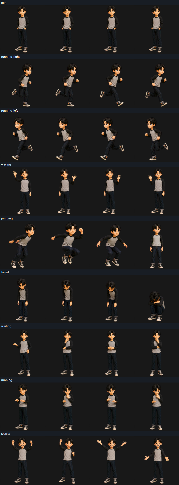

# Gyeom Companion 모션·표정 전수검수보고서

- 검수일: 2026-08-02
- 검수 대상: `GyeomPetOverlay.ps1` Companion 실행본
- 최종 판정: **로컬 데모 조건부 통과 / 상품 출시 No-Go**

## 한눈에 보는 결론

캐릭터가 중간에 통째로 작아지거나 가로·세로 비율이 찌그러지는 문제는 이번 실제
실행에서 재현되지 않았다. 9개 상태의 캐릭터 정체성, 1:1 픽셀 배율, 투명도와 셀
경계는 통과했다.

그러나 `review`는 검토가 아니라 성공 세리머니로 보이며, `waving`은 재생 중 든
손이 좌우로 바뀐다. 두 문제는 상품 의미와 모션 연속성을 훼손하므로 현재 상태를
최종 판매본으로 승인할 수 없다.

## 검수 범위와 방법

이 보고서는 Codex Native Pet v2 설치본이 아니라 Windows에서 별도 실행되는
Companion 8×9 중간 아틀라스를 검수한다. Native Pet v2 상품 규격은 8×11이며,
이 보고서로 Native Pet 설치 적합성을 주장하지 않는다.

1. 실제 WPF 오버레이를 실행했다.
2. `idle → running-right → running-left → waving → jumping → failed → waiting → running → review` 순서로 상태를 요청했다.
3. 각 상태에서 서로 다른 시점 4장을 OS 화면에서 직접 캡처했다. 실제 화면 증거는 총 36장이다.
4. 별도로 실제 재생에 사용되는 56프레임 전체를 픽셀 단위로 검사했다.
5. `hatch-pet` 공식 아틀라스 검증기와 독립 시각 검수 결과를 교차 확인했다.

## 수치 검증 결과

| 검사항목 | 결과 | 증거 |
| --- | --- | --- |
| 실제 WPF 실행 | 통과 | 창 `221×239`, 9개 상태 이벤트 기록, 종료 코드 0 |
| 화면 캡처 | 통과 | 9상태 × 4시점 = 36장 |
| 아틀라스 규격 | 통과 | PNG RGBA, `1536×1872`, 8열 × 9행 |
| 실제 재생 프레임 | 통과 | 56프레임 전부 존재 |
| 크기·비율 계약 | 통과 | X/Y 배율 1.0, 비등방 변형 0건 |
| 원본 보존 | 통과 | 정상 56셀은 원본과 픽셀 단위 동일 |
| 축소 이상치 | 통과 | `review` 원본 이상치 1셀은 정상 포즈로 교체되고 재생 목록에서 제외 |
| 잘림 | 통과 | 셀 경계 접촉 0건 |
| 미사용 셀 | 통과 | 15셀 모두 완전 투명 |
| 투명 픽셀 RGB 잔여 | 통과 | 0픽셀 |
| 공식 검증기 | 통과 | 오류 0건, 경고 0건 |

자세가 낮아져 외곽 높이가 변하는 것은 캐릭터 축소가 아니다. 점프 착지나 실패
웅크림은 원본 1:1 배율을 유지한 채 자세만 변한다. 모든 자세의 외곽 높이를 같은
값으로 확대하면 오히려 웅크린 캐릭터가 커지는 오류가 생기므로 그렇게 처리하지
않았다.

## 상태별 시각 판정

| 상태 | 크기·비율 | 모션 | 표정·의미 | 판정 | 근거 |
| --- | --- | --- | --- | --- | --- |
| `idle` | 통과 | 경고 | 통과 | **경고** | 5개 고유 모습으로 미세 변화는 있으나 눈깜빡임·호흡이 작아 정지처럼 느껴질 수 있음 |
| `running-right` | 통과 | 통과 | 통과 | **통과** | 화면 오른쪽을 향한 보폭과 팔 동작이 분명함 |
| `running-left` | 통과 | 통과 | 통과 | **통과** | 화면 왼쪽 방향과 8프레임 보행 주기가 분명함 |
| `waving` | 통과 | 실패 | 통과 | **실패** | 앞뒤 프레임에서 든 손이 좌우로 바뀌어 손이 순간이동한 것처럼 보임 |
| `jumping` | 통과 | 통과 | 통과 | **통과** | 준비·공중 웅크림·착지·기립 흐름이 읽힘 |
| `failed` | 통과 | 통과 | 통과 | **통과** | 고개 숙임에서 얼굴을 가린 웅크림까지 낙담 감정이 명확함 |
| `waiting` | 통과 | 경고 | 통과 | **경고** | 질문·생각·팔짱 포즈는 맞지만 포즈 사이 연결이 다소 급함 |
| `running` | 통과 | 경고 | 통과 | **경고** | 이동 달리기가 아닌 작업 처리 상태라는 의미는 맞지만 손·시선 변화가 약함 |
| `review` | 통과 | 통과 | 실패 | **실패** | 만세·주먹·환한 미소가 집중 검토가 아니라 성공·축하로 읽힘 |

`running`은 방향 이동용 달리기가 아니다. Companion에서 작업 실행·처리 중을
표현하는 상태이므로 제자리 집중 포즈 자체는 올바르다. 다만 현재는 동작성이 약해
기도나 박수처럼도 보일 수 있어 경고로 남겼다.

## 캐릭터 모양과 정체성

- 검은 머리, 회색·검정 래글런 상의, 검정 바지와 운동화가 모든 상태에서 유지된다.
- 얼굴과 체형이 다른 인물로 바뀌는 정체성 붕괴는 보이지 않는다.
- 가로만 늘어나거나 세로만 늘어나는 찌그러짐은 없다.
- 점프·실패에서 보이는 높이 변화는 자세 변화이며 전체 캐릭터 축소가 아니다.
- 몸이 셀 밖으로 잘리거나 이웃 셀로 넘어가는 프레임은 없다.

## 반드시 고칠 항목

### P0 — 상품 출시 차단

1. `review` 행 전체를 다시 제작한다.
   - 고개 숙임, 문서를 읽는 듯한 시선, 작은 고개 끄덕임, 눈·눈썹·손 위치 변화로 검토를 표현한다.
   - 만세, 환호, 축하 미소는 제거한다.
   - 한 셀만 붙여 고치지 말고 하나의 일관된 전체 행으로 재제작한다.
2. `waving` 행 전체에서 같은 손만 사용하도록 연속성을 고친다.
   - 손이 반대편으로 순간 이동하거나 좌우 손이 교대하지 않아야 한다.

### P1 — 상품성 보강

1. `idle`의 눈깜빡임·호흡·무게중심 이동을 화면 크기에서 읽힐 정도로 보강한다.
2. `waiting`의 질문 → 생각 → 기다림 포즈 사이에 중간 연결 자세를 보강한다.
3. `running`의 눈·고개·손 움직임을 강화해 작업 처리 중이라는 의미를 분명히 한다.

## 최종 판정

| 사용 목적 | 판정 |
| --- | --- |
| 크기·비율 교정 | **GO** |
| 개발 중 로컬 데모 | **조건부 GO** |
| Companion MVP 기능 시험 | **조건부 GO** |
| 고객 판매·상품 출시 | **No-Go** |
| Native Pet v2 설치 적합성 | **범위 밖 / 판정 불가** |

`review`와 `waving`을 전체 행 단위로 교정하고 같은 실제 화면 시험을 다시 통과해야
상품 출시 `GO`로 전환할 수 있다.

## 검수 증거

- `runtime-full-motion-contact-sheet.png`: 실제 WPF 화면 36장
- `runtime-full-motion-observation.json`: 9개 외부 상태 전환 기록
- `full-frame-audit.json`: 56개 재생 프레임 전수검사
- `full-audit-atlas-validation.json`: hatch-pet 공식 검증 결과
- `animation-consistency.json`: 상태별 재생 프레임과 1:1 배율 계약

## 남은 한계

- 실제 화면 검수는 현재 Windows PC와 현재 디스플레이 배율에서 수행했다.
- 다른 DPI, 다중 모니터, 저사양 PC의 체감 성능은 별도 시험이 필요하다.
- 36장 화면 캡처는 상태별 대표 시점을 보여준다. 모든 56프레임의 구조 검사는 별도
  픽셀 전수검사로 보완했다.
