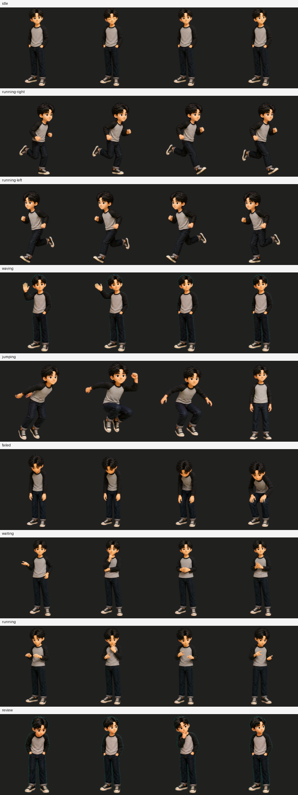

# Gyeom Companion 상품 완성 검증 보고서

- 검증일: 2026-08-02
- 대상: Windows용 `Gyeom Companion` 8×9 오버레이
- 최종 판정: **상품 출시 GO**
- 적용 범위: Companion 상품만 해당하며 Codex Native Pet v2 설치 적합성은 범위 밖이다.

## 한눈에 보는 결론

기존 상품 출시 차단 항목이었던 `waving`의 손 순간이동과 `review`의 축하·환호
표현을 전체 행 단위로 다시 제작했다. 새 프레임은 캐릭터의 얼굴, 검은 머리,
회색 몸판·검정 소매 상의, 검정 바지와 운동화를 유지한다.

실제 WPF 화면에서 9개 상태를 모두 재생해 36장을 캡처했고, 57개 재생 프레임을
픽셀 단위로 검사했다. 자동 검사와 독립 시각 검수 모두 통과했으므로 Companion
상품 완성 가설을 승인한다.

## MIA 전략 검증 기록

### 1. 기획

- 문제: 캐릭터 크기는 안정됐지만 `waving`과 `review`의 의미·연속성이 상품성을 막았다.
- 가설: 두 결함을 한 셀 보정이 아닌 전체 행 교체로 해결하면 상품 출시가 가능하다.
- 성공 임계치: 공식 아틀라스 오류·경고 0건, 57프레임 구조 오류 0건, 실제 9상태
  재생 성공, 독립 시각 QA 통과.
- 비목표: Codex 서명 파일 수정, Native Pet 8×11 호환 주장, 외부 작업 내용 자동 수집.

### 2. 검토

| 대안 | 장점 | 위험 | 결정 |
| --- | --- | --- | --- |
| 기존 행 유지 | 수정 비용 없음 | 손 순간이동과 검토 의미 오류 지속 | No-Go |
| 문제 셀만 복제 | 빠른 임시 완화 | 움직임 다양성과 전체 행 연속성 훼손 | No-Go |
| 두 행 전체 재제작 | 의미·연속성·상품성 동시 해결 | 정체성 및 크기 재검증 필요 | **Go** |

### 3. 실행

1. 원본 아틀라스에서 정체성 기준 프레임을 추출했다.
2. `waving` 4프레임을 같은 손으로만 인사하도록 전체 제작했다.
3. `review` 6프레임을 시선 이동, 고개 기울임, 턱 짚기의 차분한 검토 동작으로
   전체 제작했다.
4. 승인 프레임을 `assets/row-repairs/`에 보관하고, 정규화 도구가 두 행만
   결정론적으로 교체하도록 구현했다.
5. 실행 스크립트가 새 `review` 6프레임을 모두 재생하도록 이전 우회책을 제거했다.

### 4. 검증

| 검사항목 | 결과 | 실측 증거 |
| --- | --- | --- |
| 공식 아틀라스 검사 | 통과 | PNG RGBA, 1536×1872, 오류 0, 경고 0 |
| 투명 픽셀 품질 | 통과 | 알파 0 픽셀의 RGB 잔여 0 |
| 전체 재생 프레임 | 통과 | 57개 사용 프레임, 빈 프레임 0, 경계 접촉 0 |
| 미사용 셀 | 통과 | 15개 모두 완전 투명 |
| 원본 보존 | 통과 | 수리 대상 외 7개 행은 원본과 픽셀 단위 동일 |
| 수리 자산 보존 | 통과 | 새 10프레임 RGBA가 아틀라스에 그대로 반영됨 |
| 실제 WPF 실행 | 통과 | 창 221×239, 9상태, 36캡처, 종료 코드 0 |
| 화면 변화 | 통과 | 상태마다 고유 화면 3~4개 확인 |
| 독립 시각 QA | **PASS** | 상품 차단 결함 0건 |
| 시험 상태 복원 | 통과 | `state.json`이 기존 `idle` 값으로 복원됨 |

## 상태별 최종 판정

| 상태 | 최종 판정 | 핵심 근거 |
| --- | --- | --- |
| `idle` | 통과 | 눈·자세의 미세 변화가 있고 크기가 일정함 |
| `running-right` | 통과 | 오른쪽 달리기 방향과 보폭이 명확함 |
| `running-left` | 통과 | 왼쪽 달리기 방향과 보폭이 명확함 |
| `waving` | **통과** | 같은 손의 올림→펼침→내림이 이어짐 |
| `jumping` | 통과 | 준비→도약→착지→복귀가 읽힘 |
| `failed` | 통과 | 고개 숙임과 웅크림으로 낙담이 명확함 |
| `waiting` | 통과 | 생각·관망·손 모음으로 기다림이 읽힘 |
| `running` | 통과 | 제자리 작업 처리 동작으로 읽힘 |
| `review` | **통과** | 환호 없이 살핌→숙고→확인 흐름이 명확함 |

## 상품 판정

| 사용 목적 | 판정 |
| --- | --- |
| 개발 중 로컬 데모 | **GO** |
| Companion MVP 기능 시험 | **GO** |
| 고객 판매용 Companion | **GO** |
| Native Pet v2 설치 적합성 | 범위 밖 / 판정 불가 |

## 남은 비차단 개선점

- 내부 상태명 `running`은 화면 의미가 “작업 처리 중”에 가깝다. 다음 호환성 변경
  시 사용자 표시 이름만 `working` 또는 `처리 중`으로 개선할 수 있다.
- 이번 검증은 현재 Windows PC와 현재 디스플레이 배율에서 수행했다. 다른 DPI와
  다중 모니터 조합은 후속 호환성 시험 대상으로 남긴다.

## 검증 증거

- `product-final-runtime-contact-sheet.png`: 실제 WPF 9상태 × 4시점 화면
- `product-final-runtime-observation.json`: 실행 창·상태·캡처 기록
- `product-final-runtime-diagnostics.json`: 오버레이 내부 상태 전환 기록
- `full-frame-audit.json`: 57개 재생 프레임 전수검사
- `full-audit-atlas-validation.json`: 공식 아틀라스 검증 결과
- `product-final-waving-inspection.json`: 인사 행 구조 검사
- `product-final-review-inspection.json`: 검토 행 구조 검사
