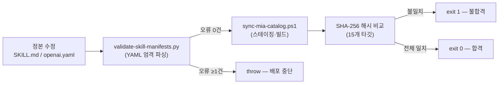

# [MIA 2단계: 검토] 배포 게이트 충분성 Decision Memo

MIA 전략절차 2단계 **검토(Review: Make the Decision Auditable)** — 현재 배포 게이트 인프라가 3대 AI 에이전트 환경에서 스킬 무결성을 보장하기에 충분한지 4대 렌즈로 평가합니다.

---

## 1. 현재 게이트 구조 실측 요약

| 게이트 계층 | 검사 내용 | 수단 |
|---|---|---|
| **L1: 매니페스트 정적 검증** | YAML 파싱, 필수키 존재, name-folder 일치, 인용 위험 패턴 | `validate-skill-manifests.py` (pyyaml) |
| **L2: 패키지 스테이징** | 정본 소스에서 필수 Entries만 추출 → 임시 폴더에 조립 | `New-StagedPackage` |
| **L3: 배포 해시 비교** | SHA-256 per-file, 15개 타깃 × 정본 스테이지 비교 | `Test-DirectoryMatch` |
| **L4: 레거시 잔류 검사** | 구명칭(`plan-review-execute`, 독립 `mia-strategic`) 6개 경로 존재 여부 | `$legacyResults` |
| **L5: 생성본 정합성** | `CLAUDE-SKILL.md`, `plugin/skills/…/SKILL.md` 텍스트 일치 | `RepositoryGeneratedMatches` |
| **L6: 안전 경로 제한** | Apply 시 허용 목록 밖 경로 거부 | `Assert-SafeTarget` |
| **L7: 자동 백업** | 기존 설치본을 `~/.mia-skill-backups/<timestamp>/`에 보존 | `Backup-And-ReplaceDirectory` |

---

## 2. 4대 렌즈 평가

### 🟢 Value (가치성) — **충분**

현재 게이트가 해결하는 문제:
- ✅ YAML 파서 엄격도 차이에 의한 결함 은폐 방지 (Codex 기준 강제)
- ✅ 15개 배포 타깃의 정본 대비 비트 단위 정합성 보장
- ✅ 레거시 잔류물 자동 감지
- ✅ 생성본(Claude 어댑터, 플러그인 복제본)의 정본 추적
- ✅ 안전 경로 허용 목록으로 의도치 않은 타깃 덮어쓰기 방지

**판정**: 3주간 은폐되었던 YAML 결함을 재현 불가능하게 막으며, 배포 전 자동 차단이 작동합니다.

### 🟡 Feasibility (실현가능성) — **부분적 약점 6건**

| # | 감지된 약점 | 심각도 | 근거 |
|---|---|---|---|
| **F1** | `validate-skill-manifests.py`가 **생성본**(CLAUDE-SKILL.md, plugin SKILL.md)을 검증하지 않음 — 정본만 검사 | 🔴 높음 | 정본 정상 + 생성본 모지바케 시나리오가 이번 세션에서 실제 발생함 |
| **F2** | Python `pyyaml` 미설치 시 `exit 2`로 중단하지만, sync 스크립트는 `throw`로만 보고 — **에이전트가 에러 메시지를 파싱하지 못하면 원인 불명 실패** | 🟡 중간 | 의존성 미설치 환경에서 진단이 어려움 |
| **F3** | **인코딩 검증 부재** — BOM 유무, 실제 바이트 인코딩을 검증하는 게이트 없음. 이번 모지바케의 근본 원인이었음 | 🔴 높음 | BOM이 다시 제거되면 같은 결함 재발 |
| **F4** | Claude 전용 프론트매터가 **PowerShell here-string에 한국어 하드코딩** — 인코딩 의존성이 높은 구조 | 🟡 중간 | 정본에서 추출하는 구조로 변경하면 인코딩 무관 |
| **F5** | `npm run check`에 `sync-mia-catalog.ps1 -Mode Check`가 **포함되지 않음** — CI 게이트에 스킬 배포 검증이 빠져있음 | 🟡 중간 | package.json의 `check` 스크립트는 typecheck+lint+handoff만 수행 |
| **F6** | **런타임 발동 테스트 부재** — 파일 해시 일치만 검증하고, 실제 에이전트가 스킬을 로딩·발동하는지는 수동 확인에 의존 | 🟡 중간 | SKILL_AUTHORING_STANDARD.md §5에서 수동 Codex 발동을 최종 관문으로 명시하고 있으나 자동화되지 않음 |

### 🟢 Viability (지속가능성) — **충분**

- 스크립트 2개(PS1 + PY) 합계 ~400줄 — 유지 부담 낮음
- 백업 자동화 → 롤백 경로 확보
- 문서(`SKILL_AUTHORING_STANDARD.md`, `plugin/README.md`)가 의사결정 맥락과 절차를 추적

### 🟡 Risk (위험도) — **보강 필요**

| 위험 | 현재 통제 | 잔여 위험 |
|---|---|---|
| 에디터가 BOM 제거 | 없음 | **F3**: `.gitattributes` 규칙으로 방어 가능 |
| 생성본 모지바케 | Check에서 해시 비교 | **F1**: 해시는 '다름'만 감지, '왜 다른지' 모름 — 인코딩 손상을 명시 진단 못함 |
| CI 누락 | 없음 | **F5**: 수동 실행에 의존 → 의미단위 커밋 시 깜빡할 수 있음 |

---

## 3. 대안 비교

### A안: 현 상태 유지 (No Change)
- 장점: 추가 작업 없음
- 단점: F1(생성본 미검증), F3(인코딩 미검증), F5(CI 미포함) 위험 잔존

### B안: 최소 보강 3건 (Recommended — Pivot)
1. **F3 해결**: `.gitattributes`에 `*.ps1 working-tree-encoding=UTF-8-BOM` 추가
2. **F1 해결**: `validate-skill-manifests.py`에 생성본(CLAUDE-SKILL.md, plugin SKILL.md) 검증 추가
3. **F5 해결**: `package.json`의 `check` 스크립트에 스킬 게이트 포함

### C안: 전면 재설계 (Overengineering)
- 정본에서 Claude/plugin 프론트매터를 자동 추출하는 빌더로 전환 + CI/CD 파이프라인
- 장점: 인코딩 의존성 완전 제거
- 단점: 스킬 3개에 대해 과잉 투자, 현 단계 가치 불충분

---

## 4. Decision Gate

> **판정: `Pivot` (B안 — 최소 보강 3건)**

| 기준 | 점수 | 근거 |
|---|---|---|
| 가치성 | ⭐⭐⭐⭐ | 이번 세션에서 실제 발생한 결함(F1·F3)의 재발을 구조적으로 차단 |
| 실현가능성 | ⭐⭐⭐⭐⭐ | `.gitattributes` 1줄 + 검증 함수 추가 + package.json 1줄 — 30분 이내 |
| 지속가능성 | ⭐⭐⭐⭐⭐ | 기존 인프라 위에 얹는 최소 변경, 유지 부담 증가 극소 |
| 위험 통제 | ⭐⭐⭐⭐ | 3대 약점 중 2건(F1·F3)은 구조적 방어, 1건(F5)은 CI 편입 |

### 다음 단계 (승인 시)
3단계(실행)로 진입하여 B안 3건을 순차 구현하고, `sync-mia-catalog.ps1 -Mode Check` + `npm run check` 재검증.
