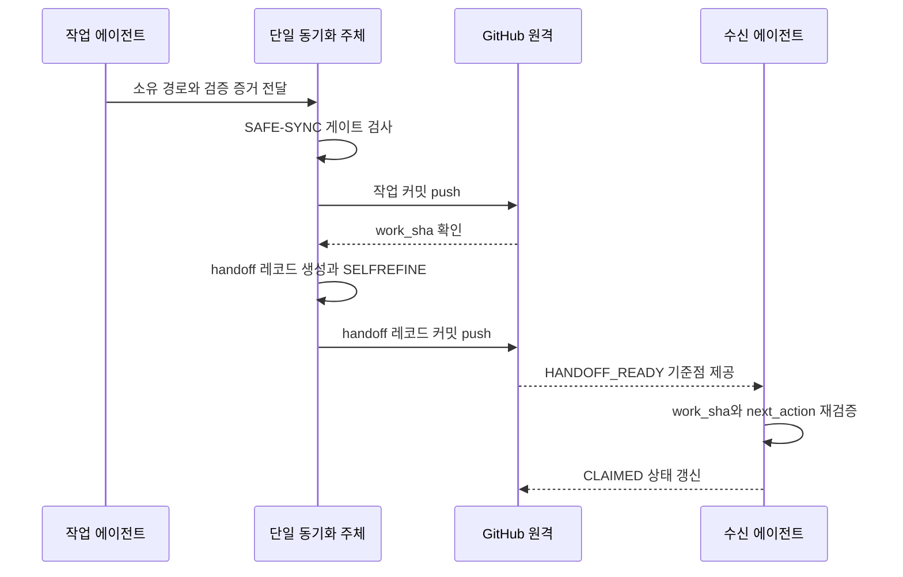

# GitHub에서 에이전트 작업을 인계하기

이 섹션은 Claude Code, Codex, Antigravity가 GitHub 커밋을 기준으로 작업을 이어받게 합니다. SAFE-SYNC가 변경을 안전하게 전송하고, handoff 레코드가 다음 작업의 시작점을 고정합니다.

## 인계 정본의 위치

실제 인계 상태는 `handoff/`에서만 관리합니다. `shared/repository-sync/`는 규칙과 연구 자료를 관리하며, 플랫폼별 폴더에는 인계 복사본을 만들지 않습니다.

```text
handoff/
├─ README.md
├─ active/
│  └─ repository-sync.md
├─ records/
├─ schemas/
│  └─ handoff.schema.json
├─ scripts/
│  └─ validate-handoff.mjs
└─ templates/
   └─ HANDOFF.md
```

`active/`에는 작업 흐름별 현재 인계를 하나씩 둡니다. 끝난 인계는 내용을 덮어쓰지 않고 `records/YYYY/MM/`로 이동합니다.

## 인계가 확정되는 지점

커밋이 하나 올라갔다는 사실만으로 인계가 끝나지 않습니다. 다음 조건을 모두 만족할 때만 `HANDOFF_READY`입니다:

1. 지정된 동기화 주체가 SAFE-SYNC 임대를 보유합니다.
2. 작업 변경을 검증한 `work_sha`가 원격 브랜치에 존재합니다.
3. handoff 레코드가 별도 커밋으로 원격 브랜치에 존재합니다.
4. 레코드의 `owned_paths`와 실제 작업 변경이 일치합니다.
5. `npm run handoff:check`가 사실성, 안전성, 최신성 검사를 통과합니다.
6. 수신자가 `work_sha`와 `next_action`을 재확인합니다.

인계 레코드는 자신의 커밋 SHA를 미리 기록할 수 없습니다. 따라서 작업 커밋과 인계 레코드 커밋을 분리합니다. GitHub의 고정 SHA 링크를 사용하면 수신자가 같은 파일 버전을 봅니다.

## 동기화와 인계를 함께 실행하는 순서



작업 에이전트와 동기화 주체가 같아도 순서는 바꾸지 않습니다. 둘 이상의 에이전트가 동시에 Git 인덱스를 변경하면 인계를 `BLOCKED`로 내립니다.

## 수신자가 작업을 재개하는 방법

수신자는 다음 순서만 수행합니다:

1. 자신의 workstream과 같은 `active/*.md`를 엽니다.
2. `repository`, `branch`, `work_sha`가 현재 저장소와 일치하는지 확인합니다.
3. `npm run handoff:check`를 실행합니다.
4. `owned_paths`의 최신성 결과를 확인합니다.
5. `next_action` 한 가지를 실행합니다.
6. 승인 필요 항목을 만나면 작업을 멈추고 사용자에게 요청합니다.

레코드는 권한을 새로 만들지 않습니다. `approvals_required`에 적힌 push, 배포, 삭제, 권한 변경은 기존 승인 규칙을 그대로 따릅니다.

## SELFREFINE 품질 회로

검증기는 최대 두 단계로 인계 품질을 판정합니다. 검사를 통과시키기 위해 증거를 약화하지 않습니다.

### 1차 검사: 사실과 모순

- 필수 필드와 자료형 확인
- `base_sha`와 `work_sha`의 Git 포함 관계 확인
- `work_sha`의 원격 브랜치 존재 확인
- `owned_paths`의 상대 경로와 최신성 확인
- `completed`와 `remaining`의 중복 확인
- 절대 경로, 자격증명 형태, 머신 전용 설정 확인

### 2차 검사: 수신자 재개 가능성

- 저장소, 브랜치, 기준 SHA 식별 가능
- 변경 소유 범위 식별 가능
- 검증 명령과 성공 기준 식별 가능
- `next_action`이 정확히 한 가지 행동을 지시
- 재검증 조건과 승인 대기 항목 식별 가능

사실성, 안전성, 최신성 중 하나라도 실패하면 상태는 `BLOCKED`입니다. 나머지 결함은 두 번 안에 고치며, 세 번째 정제 반복은 만들지 않습니다.

## 검증 명령

활성 인계만 검사하려면 다음 명령을 실행합니다:

```powershell
npm run handoff:check
```

전체 저장소 검사는 handoff 검증까지 포함합니다:

```powershell
npm run check
```

## GitHub 연결의 다음 단계

파일 기반 인계가 10회 연속 오판 없이 통과한 뒤 Issue Form, Pull Request 템플릿, 상태 라벨을 추가합니다. Issue와 Pull Request는 담당자·대화·알림을 관리하며, 기술적 정본은 계속 `handoff/`가 맡습니다.

설계 근거와 세 대안 비교는 [GitHub handoff 설계](../shared/repository-sync/MIA_GITHUB_HANDOFF_DESIGN_2026-07-20.md)에서 확인합니다.
