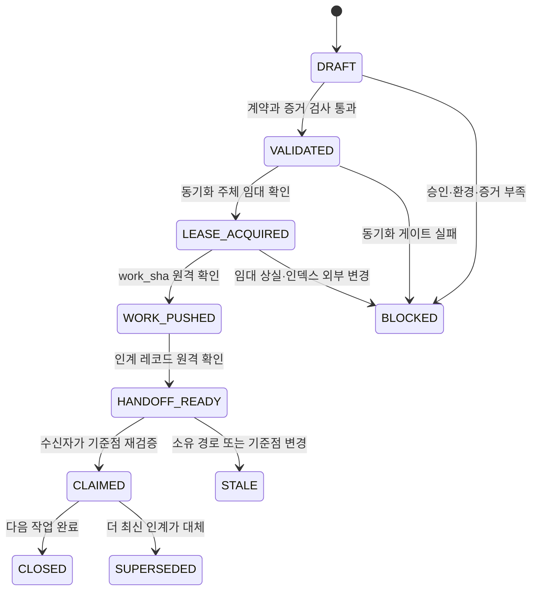

# GitHub를 에이전트 인계 지점으로 설계하기

> 상태: `PILOT_IMPLEMENTED`. 이 문서는 GitHub 저장소를 Claude Code, Codex, Antigravity 사이의 검증 가능한 인계 지점으로 만드는 설계안입니다. 루트 `handoff/` 파일럿과 로컬 검증기를 구현했으며, GitHub Issue 양식은 아직 만들지 않습니다.

## 결론

루트 `handoff/`를 인계 정본으로 만들고, GitHub Issue와 Pull Request (PR)는 담당자·대화·알림을 연결하는 선택 계층으로 사용합니다. 인계 완료 시점은 작업 커밋이 올라간 때가 아닙니다. 단일 동기화 주체가 임대를 획득하고 인계 레코드까지 별도 커밋으로 원격에 올린 뒤, 수신자가 같은 커밋과 검증 결과를 재확인할 수 있을 때 `HANDOFF_READY`가 됩니다.

이 방식은 현재 SAFE-SYNC를 대체하지 않습니다. SAFE-SYNC가 안전한 동기화를 증명한 뒤 handoff가 다음 작업의 시작점을 고정합니다.

## 해결할 문제

기존 HANDOFF 문서는 많은 맥락을 보존하지만 공통 상태, 필수 필드, 만료 조건이 없습니다. 일부 문서는 머신 절대 경로와 개인 원본 위치를 포함해 다른 환경에서 재현하기 어렵고 공개 저장소에 불필요한 정보를 남길 수 있습니다.

새 계약은 다음 결과를 만들어야 합니다:

- 수신자가 5분 안에 현재 상태와 다음 한 가지 행동을 찾음
- 인계가 가리키는 파일과 결과를 커밋 SHA로 고정함
- 완료, 미완료, 추정, 승인 대기를 분리함
- 절대 경로, 개인 자료, 토큰, 쿠키, 머신 설정을 제외함
- 다른 작업이 같은 파일을 바꾸면 인계를 자동으로 오래된 상태로 판정함
- 인계 문서를 반복해서 다듬느라 작업 비용이 커지지 않음

## 세 가지 구조 대안

| 대안 | 구조 | 장점 | 약점 | 결정 |
|---|---|---|---|---|
| A. 루트 전용 섹션 | `handoff/`에 규칙·활성 인계·기록 배치 | GitHub와 로컬에서 즉시 발견, 플랫폼 중립 | 루트 섹션 하나 증가 | 채택 |
| B. 동기화 하위 섹션 | `shared/repository-sync/handoff/` | SAFE-SYNC와 가까움, 루트가 짧음 | 실제 인계 상태가 운영 문서 안에 묻힘 | 설계 자료 위치로만 사용 |
| C. GitHub Issue·PR 전용 | `.github/` 양식과 Issue·PR만 사용 | 담당자, 알림, 대화, 라벨에 강함 | 네트워크 의존, 로컬 에이전트가 놓칠 수 있음 | 선택 연결 계층 |

권장안은 A와 C의 결합입니다. 저장소 파일이 기술적 정본을 맡고, Issue·PR이 협업 상태를 맡습니다. GitHub Issue 양식은 필수 입력과 유효성 검사를 지원하지만 공개 미리보기 기능이므로 인계 정본을 Issue에만 두지 않습니다. [GitHub Issue 양식 규격](https://docs.github.com/en/enterprise-cloud%40latest/communities/using-templates-to-encourage-useful-issues-and-pull-requests/syntax-for-issue-forms)과 [Issue·PR 템플릿 안내](https://docs.github.com/en/communities/using-templates-to-encourage-useful-issues-and-pull-requests/about-issue-and-pull-request-templates)를 참고합니다.

## 권장 폴더 구조

```text
handoff/
├─ README.md                 # 인계 계약과 상태 정의
├─ active/                   # 작업 흐름별 현재 인계, 여러 개 허용
│  └─ <workstream>.md
├─ records/                  # 완료·중단된 append-only 기록
│  └─ YYYY/MM/<handoff-id>.md
├─ templates/
│  └─ HANDOFF.md
└─ schemas/
   └─ handoff.schema.json
```

단일 `CURRENT.md`는 만들지 않습니다. 여러 에이전트가 동시에 한 파일을 고치면 병합 충돌과 상태 덮어쓰기가 발생하기 때문입니다. `active/<workstream>.md`는 작업 흐름마다 하나를 사용합니다.

`shared/repository-sync/`는 SAFE-SYNC와 handoff 설계 원칙을 관리합니다. 실제 인계 상태는 루트 `handoff/`만 소유합니다. 플랫폼별 폴더에는 중복 인계 정본을 만들지 않습니다.

## 인계 지점을 확정하는 규칙

작업 결과와 인계 레코드를 한 커밋에 넣으면 레코드가 자신의 최종 SHA를 미리 알 수 없습니다. 두 커밋 프로토콜로 이 순환을 끊습니다:

1. 지정된 동기화 주체가 SAFE-SYNC 임대를 획득함
2. 작업 변경을 검증하고 `work_sha`로 커밋·푸시함
3. `work_sha`, 검증 결과, 남은 일, 다음 행동을 인계 레코드에 기록함
4. 인계 레코드를 별도 커밋으로 푸시함
5. 로컬 HEAD와 원격 브랜치가 일치하는지 확인함
6. 수신자가 `work_sha`와 인계 레코드를 읽을 수 있을 때 `HANDOFF_READY`로 판정함

임대를 획득하지 않은 에이전트는 파일 편집과 검증까지만 수행합니다. 스테이징, 커밋, push는 동기화 주체에 요청합니다. 임대가 바뀌거나 인덱스가 외부에서 변경되면 인계를 `BLOCKED`로 내리고 새 기준점에서 다시 판정합니다. 자세한 임대 계약은 [SAFE-SYNC 정본](README.md)을 따릅니다.

GitHub는 커밋 SHA를 특정 변경과 시점의 고유 식별자로 사용합니다. 파일 링크도 브랜치명이 아니라 커밋 ID를 쓰면 같은 내용을 계속 가리킵니다. [GitHub 커밋 안내](https://docs.github.com/en/pull-requests/committing-changes-to-your-project/creating-and-editing-commits/about-commits)와 [파일 영구 링크 안내](https://docs.github.com/en/repositories/working-with-files/using-files/getting-permanent-links-to-files)를 근거로 삼습니다.

## 상태 기계



상태 의미:

- `DRAFT`: 작성 중이며 후속 작업의 기준으로 사용하지 않음
- `VALIDATED`: 필수 필드, 보안, 검증 증거가 맞음
- `LEASE_ACQUIRED`: 지정된 동기화 주체가 인덱스 변경 권한을 확보함
- `WORK_PUSHED`: `work_sha`가 원격에 존재함
- `HANDOFF_READY`: 인계 레코드도 원격에 존재해 인계가 성립함
- `CLAIMED`: 수신자가 기준점과 다음 행동을 확인함
- `BLOCKED`: 승인이나 환경 변화가 없으면 진행할 수 없음
- `STALE`: 인계 후 소유 경로나 기준점이 달라져 재검증이 필요함
- `CLOSED`: 목표가 끝났고 기록 폴더로 이동함

## 인계 레코드 계약

모든 활성 인계는 다음 필드를 포함합니다:

| 필드 | 질문 | 필수 |
|---|---|---|
| `handoff_id` | 이 인계를 고유하게 식별하는가 | 예 |
| `status` | 현재 상태가 무엇인가 | 예 |
| `workstream` | 어느 작업 흐름인가 | 예 |
| `objective` | 무엇을 끝내려는가 | 예 |
| `repository`·`branch` | 어느 저장소와 브랜치인가 | 예 |
| `base_sha`·`work_sha` | 시작점과 전달할 결과가 무엇인가 | 예 |
| `owned_paths` | 어떤 파일을 이 작업이 소유하는가 | 예 |
| `completed` | 관측으로 증명된 완료 항목은 무엇인가 | 예 |
| `remaining` | 아직 하지 않은 일은 무엇인가 | 예 |
| `verification` | 어떤 명령이 어떤 결과를 냈는가 | 예 |
| `decisions` | 선택과 기각 이유는 무엇인가 | 중요 결정 시 |
| `risks` | 실패 가능성과 복구 방법은 무엇인가 | 예 |
| `approvals_required` | 사용자 승인이 필요한 다음 작업은 무엇인가 | 해당 시 |
| `next_action` | 수신자가 가장 먼저 할 한 가지 행동은 무엇인가 | 예 |
| `revalidate_when` | 언제 이 인계를 오래된 상태로 볼 것인가 | 예 |

최소 메타데이터 예시:

```yaml
handoff_id: sync-handoff-20260720-001
status: HANDOFF_READY
workstream: repository-sync
objective: SAFE-SYNC 다음 실행 지점을 전달한다
repository: gyeomsVibe/260718_agentic-ai-platform-optimization
branch: main
base_sha: parent_commit_sha
work_sha: verified_work_commit_sha
owned_paths:
  - shared/repository-sync/
completed:
  - npm run check 통과
remaining:
  - handoff 파일럿 승인
approvals_required:
  - 루트 handoff 섹션 생성
next_action: work_sha와 원격 main의 포함 관계를 확인한다
revalidate_when:
  - owned_paths가 work_sha 이후 변경됨
```

실제 값은 레코드 본문에서 설명합니다. YAML에는 긴 로그, 사용자 원본 경로, 비밀값을 넣지 않습니다.

## SELFREFINE 회로

인계 문서는 초안을 길게 만드는 대신 최대 두 번만 정제합니다. 두 번 뒤에도 필수 사실을 확인하지 못하면 `HANDOFF_READY`로 올리지 않고 `BLOCKED`로 종료합니다.

### 1차 정제: 사실과 모순 검사

다음을 기계적으로 확인합니다:

1. `work_sha`가 원격 브랜치에 존재함
2. `owned_paths`가 실제 변경 목록과 일치함
3. 검증 명령과 결과가 실행 로그와 일치함
4. `completed`와 `remaining`이 같은 항목을 동시에 주장하지 않음
5. `status`가 증거 수준보다 앞서지 않음
6. 절대 경로, 개인 자료, 토큰, 쿠키, 머신 설정이 없음

### 2차 정제: 수신자 재개 시뮬레이션

수신자가 추가 질문 없이 다음을 수행할 수 있는지 확인합니다:

1. 저장소, 브랜치, 기준 SHA를 찾음
2. 변경 파일과 건드리면 안 되는 파일을 구분함
3. 첫 명령 또는 첫 행동을 실행함
4. 성공과 실패 기준을 판정함
5. 승인이 필요한 행동 전에 멈춤

하나라도 실패하면 해당 필드만 보완합니다. 배경 설명을 늘리는 방식으로 결함을 숨기지 않습니다.

### 정제 점수표

| 기준 | 통과 조건 |
|---|---|
| 진실성 | 모든 완료 주장이 실행·Git 증거와 연결됨 |
| 재현성 | 저장소 상대 경로와 고정 SHA만으로 기준점을 찾음 |
| 실행성 | `next_action`이 한 개이며 바로 실행 가능함 |
| 안전성 | 민감정보와 머신 고유 자료가 없음 |
| 최신성 | 원격과 인계 기준점이 일치함 |
| 간결성 | 같은 사실을 두 섹션 이상 반복하지 않음 |

진실성, 안전성, 최신성은 하나라도 실패하면 즉시 `BLOCKED`입니다. 나머지는 두 번의 정제 안에서 고칩니다.

## 인계가 오래된 상태가 되는 조건

시간이 지났다는 이유만으로 인계를 폐기하지 않습니다. 다음 사건이 발생하면 `STALE`로 바꿉니다:

- `owned_paths`가 `work_sha` 이후 변경됨
- 원격 브랜치가 다른 이력으로 교체됨
- 검증에 사용한 플랫폼·앱·의존성 버전이 바뀜
- 필요한 승인이나 정책이 변경됨
- 더 최신 `handoff_id`가 같은 workstream을 대체함

수신자는 `git diff <work_sha>..HEAD -- <owned_paths>`로 소유 경로 변경을 확인합니다. 변경이 없으면 인계를 재사용할 수 있습니다.

## 보안과 개인정보 경계

새 인계 레코드에는 저장소 상대 경로만 기록합니다. 다음 정보는 넣지 않습니다:

- 사용자 홈, 사진 폴더, 임시 폴더의 절대 경로
- 개인 사진과 개인 원본의 파일명·위치
- 토큰, 쿠키, 세션, 인증서, 비밀 설정
- 전체 로그와 원문 덤프
- 전역 설치 경로의 개인화된 사용자명

필요한 로컬 자료는 `local_dependency: redacted`와 확인 방법만 기록합니다. GitHub가 접근할 수 없는 자료를 인계의 유일한 근거로 사용하지 않습니다.

## GitHub 연결 계층

파일 기반 인계가 안정된 뒤 다음 기능을 선택적으로 연결합니다:

1. `.github/ISSUE_TEMPLATE/handoff.yml`: 담당자, 상태, 승인 요청을 구조화함
2. `.github/PULL_REQUEST_TEMPLATE/handoff.md`: 변경 검토와 인계 체크리스트를 제공함
3. `handoff-ready`, `handoff-claimed`, `handoff-blocked` 라벨: 협업 상태를 표시함
4. Issue 또는 PR 본문에서 `work_sha`와 인계 레코드 영구 링크를 연결함

GitHub는 Issue, PR, 커밋 SHA 참조를 자동 링크합니다. 파일 안의 `#123`은 자동 링크되지 않으므로 인계 레코드에는 전체 Issue·PR URL 또는 명시적 Markdown 링크를 사용합니다. [GitHub 자동 링크 규칙](https://docs.github.com/en/get-started/writing-on-github/working-with-advanced-formatting/autolinked-references-and-urls)을 따릅니다.

## 도입 단계

| 단계 | 범위 | 성공 조건 |
|---|---|---|
| 0. 설계 | 이 문서만 검토 | 사용자 승인 |
| 1. 로컬 파일럿 | `handoff/README.md`, 템플릿, 활성 인계 1개 | 수신자가 5분 안에 재개 |
| 2. 교차 플랫폼 | Claude Code·Codex·Antigravity가 같은 인계를 각각 재개 | 잘못된 완료 주장 0건 |
| 3. GitHub 연결 | Issue 또는 PR 양식과 라벨 추가 | 파일 정본과 상태 불일치 0건 |
| 4. 자동 검사 | 스키마·SHA·민감 경로 검사 | 오탐 없이 10회 연속 통과 |

처음부터 Action, 봇, 자동 담당자 배정을 만들지 않습니다. 파일럿이 실패하면 문서 계약만 고치고 자동화 비용을 추가하지 않습니다.

## 기존 HANDOFF 문서 처리

기존 `codex/HANDOFF_*.md`는 당시 사건 증거이므로 즉시 삭제하지 않습니다. 새 계약을 승인한 뒤 다음 순서로 정제합니다:

1. 원본 해시와 역사적 의미를 기록함
2. 절대 경로와 개인 원본 위치를 제거하거나 비공개 증거로 분리함
3. 재사용 가능한 결정·검증·다음 행동만 새 레코드 계약으로 변환함
4. 기존 문서를 `records/legacy/`로 이동하고 현재 정본이 아님을 표시함

공개 Git 기록에서 민감정보를 완전히 제거하려면 이력 재작성과 파급 범위 검토가 필요합니다. 별도 승인 없이 수행하지 않습니다.

## 결정 게이트

결정은 `Go`이며 루트 `handoff/` 파일럿을 구현했습니다. 프로토콜 README, Markdown 템플릿, JSON Schema, 무의존성 검증기, repository-sync 활성 인계 1개가 현재 범위입니다.

다음 승인 단위는 세 플랫폼에서 같은 활성 인계를 10회 재개하는 검증입니다. GitHub Issue 양식과 기존 HANDOFF 이관은 파일럿 검증 뒤 별도 단계로 남깁니다.
