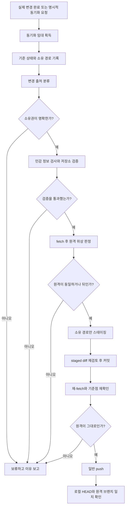

# 워크스페이스와 GitHub 최신성 동기화

이 문서는 AI 에이전트가 만든 검증된 변경만 GitHub에 반영하는 SAFE-SYNC의 정본입니다.
주기적으로 저장소를 확인하지 않습니다. 실제 변경이 끝났을 때만 한 번 실행하므로 변경이
없으면 명령, 커밋, 네트워크 비용도 발생하지 않습니다.

## 한 문장 원칙

> 동기화는 파일 전체 복사가 아니라, 출처가 확인된 변경을 검증한 뒤 원격 이력을
> 훼손하지 않는 방식으로 전달하는 작업이다.

## 해결하려는 문제

일반적인 자동 커밋은 작업 폴더의 모든 변경을 한꺼번에 담기 쉽습니다. 여러 AI 도구와
사용자가 같은 저장소를 다루면 다음 문제가 생깁니다.

- 사용자가 작성 중인 파일이 에이전트 변경과 함께 외부에 공개될 수 있습니다.
- `.env`, 토큰, 머신 전용 설정이 실수로 커밋될 수 있습니다.
- 다른 작업이 먼저 원격을 갱신했는데 자동 rebase나 force push가 이력을 바꿀 수 있습니다.
- 변경이 없는데도 타이머가 계속 실행되어 비용과 알림만 늘어날 수 있습니다.

SAFE-SYNC는 시간 기반 자동화가 아니라 사건 기반 자동화입니다. 에이전트가 실제로 파일을
바꾸고 검증을 마쳤거나 사용자가 동기화를 요청한 경우에만 시작합니다.

## 동기화 예산과 인계 발동

파일 하나를 저장하거나 문장을 고쳤다는 이유로 동기화하지 않습니다. 한 의미 단위의 작업이
검증까지 끝났을 때 일반 작업 커밋 1개와 일반 push 1회만 실행합니다. 같은 의미 단위에는
동기화 시도를 최대 1회로 제한하며, 변경이 없으면 검사·fetch·커밋·네트워크 요청을 하지
않습니다.

작업 커밋 뒤 handoff 레코드를 별도 커밋하는 2커밋 프로토콜은 윤겸스가 인계 또는 플랫폼 간
재개를 명시적으로 요청한 경우에만 사용합니다. 일반 작업 종료, 에이전트 교체, 작은 유지보수는
인계 발동 조건이 아닙니다.

## 통일된 규칙 제정 원리

모든 저장소 규칙은 다음 순서로 설계합니다.

1. **목적**: 무엇을 최신 상태로 유지할지 한 문장으로 정합니다.
2. **소유권**: 이번 실행이 만든 경로를 시작 전에 기록합니다.
3. **단일 작성자**: 한 저장소에서는 한 동기화 주체만 스테이징과 커밋 권한을 가집니다.
4. **금지선**: 비밀정보, 머신 설정, 대용량 파일, 이력 재작성은 기본 차단합니다.
5. **판정 가능성**: 자동화가 예 또는 아니오로 판단할 수 있는 조건만 규칙으로 만듭니다.
6. **최소 권한**: 전체 작업 트리가 아니라 승인된 저장소와 명시 경로만 다룹니다.
7. **검증 선행**: 저장소가 정한 테스트나 문서 검사를 통과한 뒤 커밋합니다.
8. **불확실성 정지**: 출처, 민감성, 원격 상태가 모호하면 추측하지 않고 보류합니다.
9. **가역성**: force push나 자동 rebase 대신 새 커밋과 명시적 복구 절차를 사용합니다.
10. **관찰 가능성**: 실행 결과에 대상 파일, 검사 결과, 커밋, 원격 상태, 보류 사유를 남깁니다.
11. **순복잡도 제한**: 새 규칙의 안전 효과가 유지 비용보다 클 때만 공통 규칙에 올립니다.

상시 로드되는 `AGENTS.md`, `CLAUDE.md`, `GEMINI.md`에는 핵심 게이트와 이 문서의 링크만
둡니다. 자세한 명령과 예외는 이 정본에서 관리해 도구별 규칙의 토큰 사용량과 불일치를
줄입니다.

## SAFE-SYNC 상태 기계



## 단계별 실행 매뉴얼

아래 명령은 예시입니다. 저장소가 지정한 원격과 기본 브랜치로 바꿔 사용합니다.

### 0. 단일 동기화 주체를 확보합니다

여러 에이전트가 같은 저장소를 다루더라도 스테이징, 커밋, push는 지정된 동기화 주체
하나만 수행합니다. 구현할 때는 작업 트리 밖의 `.git/safe-sync.lock` 같은 임대 파일이나
오케스트레이터 잠금을 원자적으로 획득합니다. 임대에는 저장소, 작업 ID, 시작 시각, 기준
커밋을 기록하고, 정상 종료 때 해제합니다.

이미 유효한 임대가 있으면 기다리거나 보류합니다. 오래된 임대로 보여도 프로세스와 작업
상태를 확인하기 전에는 임의 삭제하지 않습니다. 임대를 획득하지 않은 에이전트는 파일 편집과
검증까지만 수행하고, 커밋 요청을 동기화 주체에 넘깁니다.

### 1. 기준 상태를 기록합니다

```powershell
git branch --show-current
git rev-parse HEAD
git status --porcelain=v1 -z
```

`--porcelain=v1`은 사용자 Git 설정과 무관하게 스크립트가 읽을 수 있는 안정된 형식입니다.
파일명 안전성을 위해 자동화에서는 `-z` 출력을 사용합니다.

### 2. 변경을 소유권별로 분류합니다

| 분류 | 의미 | 자동 처리 |
|---|---|---|
| A | 이번 실행이 직접 만든 변경 | 다음 게이트로 이동 |
| U | 실행 전부터 있던 사용자 또는 다른 도구의 변경 | 보존하고 제외 |
| X | 실행 중 새로 나타났지만 출처를 확인할 수 없는 변경 | 전체 동기화 보류 |

에이전트는 A 경로의 명시 목록을 유지해야 합니다. `git add .`와 `git add -A`는 사용하지
않습니다. U가 존재해도 A와 경로가 겹치지 않고 검증에 영향을 주지 않으면 A만 처리할 수
있습니다. 경로가 겹치면 자동 분리가 불가능하므로 멈춥니다.

### 3. 하드 제외와 검토 대상을 판정합니다

다음 항목은 내용을 읽거나 추정하지 않고 경로와 파일 유형만으로 자동 제외합니다.

- `.env`와 변형 파일, 개인 키, 인증서, 토큰, 쿠키, 자격증명
- `.claude/settings.local.json`, `.agents/config.json`, `.agents/mcp_config.json` 같은 머신 설정
- `node_modules`, 캐시, 로그, 임시 파일
- 저장소 정책에 없는 빌드 산출물과 바이너리

1 MiB 이상 파일은 기본 검토 대상으로 두되 자동 삭제하지 않습니다. 생성 산출물도
저장소가 의도적으로 추적하고 재현 절차가 있는 경우에만 허용합니다. 이 구분은 파일 크기나
생성 여부만으로 사용자 자료를 지우지 않기 위한 것입니다.

### 4. 저장소 검증을 실행합니다

검증 명령은 저장소별 어댑터에서 선언합니다. 이 저장소는 다음 명령을 사용합니다.

```powershell
npm run check
```

검사가 사용자 변경 때문에 실패했거나 검사 도구가 소유 경로 밖을 수정했다면 자동 커밋을
중단합니다. 통과 결과를 만들기 위해 검사를 약화하지 않습니다.

### 5. 원격 상태만 가져와 위상을 판정합니다

```powershell
git fetch origin main
git rev-list --left-right --count HEAD...origin/main
```

왼쪽 수는 로컬에만 있는 커밋, 오른쪽 수는 원격에만 있는 커밋입니다.

| 결과 | 상태 | 기본 행동 |
|---|---|---|
| `0 0` | 동일 | 계속 |
| `N 0` | 로컬만 앞섬 | 커밋 출처가 승인 범위인지 확인 후 계속 |
| `0 N` | 원격만 앞섬 | 중단하고 보고 |
| `N M` | 분기됨 | 중단하고 보고 |

전역 기본값은 원격 선행 상태도 자동 병합하지 않는 것입니다. 깨끗한 작업 트리에서
`git merge --ff-only origin/main`을 허용하려면 해당 저장소가 명시적으로 선택해야 합니다.
자동 `pull --rebase`, 자동 merge, force push는 사용하지 않습니다.

### 6. 소유 경로만 스테이징하고 다시 검사합니다

```powershell
git add -- path/to/owned-file path/to/another-owned-file
git diff --cached --name-status
git diff --cached --check
```

스테이징 목록이 A 목록과 정확히 같아야 합니다. 이 단계에서 민감 문자열의 형태, 바이너리,
예상하지 못한 삭제와 이름 변경을 다시 검사합니다. 실제 비밀값은 로그에 출력하지 않습니다.

### 7. 커밋하고 원격 기준점을 재확인합니다

Conventional Commits 형식으로 한 의미 단위만 커밋합니다. 커밋 직후 다시 fetch하고 원격
브랜치가 5단계에서 본 기준점과 같은지 확인합니다. 이 이중 확인은 검사와 push 사이에 다른
작업이 원격을 갱신하는 경쟁 조건을 막습니다.

### 8. 일반 push 후 결과를 검증합니다

```powershell
git push origin HEAD:main
git fetch origin main
git rev-parse HEAD
git rev-parse origin/main
git status --porcelain=v1
```

두 커밋 ID가 같아야 동기화 완료입니다. U 변경은 그대로 남아 있어도 됩니다. 완료 보고에는
커밋에 포함한 파일, 제외한 사용자 변경, 검사 결과, 원격 일치 여부를 적습니다.

## 보류와 복구 원칙

- 커밋 전 문제는 A 경로만 스테이징 해제하고 파일은 보존합니다.
- 커밋 후 push 전 문제는 이력을 강제로 되돌리지 않고 커밋과 보류 사유를 보고합니다.
- push 후 오류는 별도 승인 아래 되돌림 커밋을 만듭니다. 공개 이력을 재작성하지 않습니다.
- 세 번 같은 실패가 반복되면 재시도하지 않고 로그, 원인, 우회 방법 순서로 보고합니다.
- 다른 주체가 기준 커밋, 인덱스, 작업 트리를 바꾸면 임대를 반납하고 새 기준점에서 다시
  판정합니다. 이미 같은 변경이 커밋됐다면 중복 커밋을 만들지 않습니다.

## 저장소별 어댑터 템플릿

각 저장소에는 상세 매뉴얼을 복사하지 않고 아래 값만 선언합니다.

```markdown
## Repository sync adapter

- Canonical policy: <정본 문서 링크와 고정 버전>
- Remote: origin
- Protected branch: main
- Verification: <명령>
- Agent-owned paths: <작업마다 기록>
- Sync owner: <도구 또는 오케스트레이터 ID>
- Lease mechanism: <작업 트리 밖 잠금 위치 또는 서비스>
- Additional exclusions: <저장소 전용 제외 경로>
- Generated artifacts: tracked | untracked | review
- Large-file review threshold: 1 MiB
- Push authorization: ask | standing-for-this-repository
- Remote-ahead policy: stop | explicit-fast-forward
```

`standing-for-this-repository`는 그 저장소 하나에만 적용합니다. 다른 저장소, 배포, 릴리스,
패키지 게시, 계정과 권한 변경으로 승인을 확장하지 않습니다.

## 운영 체크리스트

동기화 전:

- [ ] 실제 변경이 있고 이번 실행의 소유 경로가 명확합니다.
- [ ] 실행 전 사용자 변경 목록을 보존했습니다.
- [ ] 하드 제외 파일이 소유 경로와 스테이징에 없습니다.
- [ ] 저장소 검증이 통과했습니다.
- [ ] fetch 후 원격이 앞서거나 분기되지 않았습니다.

동기화 후:

- [ ] 스테이징과 커밋에 소유 경로만 포함됐습니다.
- [ ] force push, 자동 rebase, 자동 merge를 사용하지 않았습니다.
- [ ] 로컬 HEAD와 원격 브랜치가 일치합니다.
- [ ] 제외한 사용자 변경과 실행하지 않은 검증을 보고했습니다.

## 공식 근거

- Git의 [`status --porcelain`](https://git-scm.com/docs/git-status)은 스크립트용 안정 형식을 제공합니다.
- Git의 [`rev-list --left-right --count`](https://git-scm.com/docs/git-rev-list)은 양쪽에만 있는 커밋 수를 구분합니다.
- Git의 [`merge --ff-only`](https://git-scm.com/docs/git-merge)은 fast-forward가 불가능하면 병합을 거부합니다.
- Git의 [push 규칙](https://git-scm.com/docs/git-push)은 일반 push에서 비 fast-forward 갱신을 거부해 이력 손실을 막습니다.
- GitHub [rulesets](https://docs.github.com/en/repositories/configuring-branches-and-merges-in-your-repository/managing-rulesets/about-rulesets)은 여러 보호 규칙을 함께 적용할 수 있습니다.
- GitHub [secret scanning](https://docs.github.com/en/code-security/concepts/secret-security/secret-scanning)은 원격에 도달한 자격증명을 탐지하는 보조 방어선입니다.

## 관련 설계

- [GitHub 에이전트 인계 설계](MIA_GITHUB_HANDOFF_DESIGN_2026-07-20.md): 루트 `handoff/` 대안, 인계 지점, 상태 기계, 레코드 계약, SELFREFINE 회로
- [운영 handoff 정본](../../handoff/): 활성 인계, 템플릿, 스키마, 검증기
