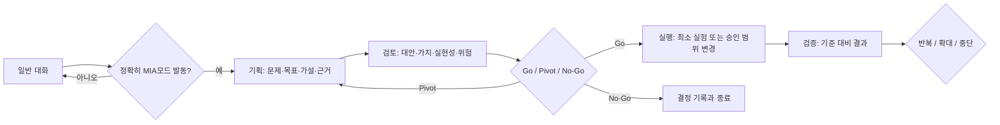
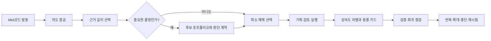

# 기획·검토·실행 모드 보고서

## 1. 한 줄 정의

기획·검토·실행 모드는 모호한 제품·사업·의미 있는 기술 기회를 **근거 기반의 결정**으로 바꾸고, 승인된 최소 실행과 결과 검증까지 연결하는 선택형 워크플로우다.

## 2. 이름과 발동 계약

| 항목 | 정의 |
|---|---|
| 사람에게 보이는 이름 | 기획·검토·실행 모드 |
| 내부 식별자 | `plan-review-execute` |
| 유일한 사용자 발동 문구 | `MIA모드 발동` |
| 기본 단계 | `기획` |
| 실행 권한 | 발동 문구 자체로는 부여되지 않음 |

`MIA`는 **Modular Intelligence Architect(모듈러 인텔리전스 아키텍트)**의 약자다. 기획·검토·실행·검증을 하나의 거대한 지시문으로 처리하지 않고, 필요한 판단 회로를 선택적으로 연결하는 아키텍트 역할을 뜻한다. `MIA모드 발동`은 이 아키텍처를 의도적으로 시작하는 단일 발동 문구다.

### 사용 문법

```text
MIA모드 발동: [기획|검토|실행|검증] 목표
```

단계는 생략할 수 있다. 예를 들어 `MIA모드 발동: 신규 예약 기능`은 `기획`부터 시작한다.

```text
MIA모드 발동: 검토 신규 예약 기능의 우선순위
MIA모드 발동: 실행 승인된 온보딩 실험안
MIA모드 발동: 검증 지난 실험의 결과와 다음 결정
```

## 3. 발동 설계 원칙

이 모드는 일반적인 답변 스타일이 아니라 작업 흐름을 전환하는 장치다. 따라서 `기획`, `검토`, `사업성`, `아이디어`, `기능`, `계획` 같은 일상 단어만으로는 발동하지 않는다.

이 결정은 다음 위험을 막는다.

- 단순 코드 리뷰나 문서 작성에 과도한 조사·의사결정 절차가 끼어드는 문제
- 진행 중인 작업의 맥락이 불필요한 사업·제품 검토로 전환되는 문제
- 사용자가 원하지 않은 계획 문서나 실행 단계를 생성하는 문제
- 긴 워크플로우가 매 대화에 적재되어 응답 집중도와 속도를 떨어뜨리는 문제

정확히 `MIA모드 발동`이라고 말하는 것은 사용자가 이 흐름을 의도적으로 선택했다는 신호다. 이 문구 뒤에 목표와 단계를 붙이면 가장 정확하다.

## 4. 동작 로직



### 기획

- 결정할 문제, 대상 사용자·이해관계자, 제약과 기한을 정의한다.
- 원하는 결과, 성공 신호, 제외 범위, 핵심 가설을 분리한다.
- 확인된 사실·가정·미확인 사항을 구분하고, 불확실성을 줄일 가장 싼 검증 방법을 정한다.

산출물은 **Opportunity Brief와 근거 수집 계획**이다.

### 검토

2~3개 대안(필요하면 아무것도 하지 않는 선택 포함)을 비교한다.

- 가치(Desirability): 실제 사용자 또는 이해관계자의 문제를 해결하는가
- 실현 가능성(Feasibility): 기술, 시간, 인력, 의존성이 가능한가
- 지속 가능성(Viability): 비용, 보안, 정책, 법률, 운영 영향이 수용 가능한가
- 위험(Risk): 가장 큰 불확실성, 완화 방법, 되돌리기 경로는 무엇인가

산출물은 근거·대안·위험·결정 조건을 담은 **Decision Memo**다. 끝에는 `Go`, `Pivot`, `No-Go`, `Research more` 중 하나를 명시한다.

### 실행

`Go` 결정과 사용자의 명확한 범위 요청 뒤에만 진행한다.

- 최소 실행 단위, 제외 범위, 수용 기준(Acceptance Criteria)을 정한다.
- 책임자, 마일스톤, 의존성, 되돌리기 방법을 명시한다.
- 선행 지표, 측정 방법, 판단일, 성공 기준을 먼저 정한다.

코드·설정 작업은 승인된 로컬의 되돌릴 수 있는 변경만 수행하고, 작업 규모에 맞는 테스트·검증을 한다. 배포·삭제·결제·권한 변경·외부 연락은 이 모드가 발동되었더라도 별도 승인 없이는 하지 않는다.

산출물은 **Delivery Card**다.

### 검증

사전에 정한 기준과 실제 결과를 비교한다. 결과를 성공으로 포장하지 않고, 증명된 사실과 남은 가정을 나눈다. 결론은 `반복`, `확대`, `중단` 중 하나와 다음 실험이다.

산출물은 **Learning Report**다.

## 5. 도구별 적용 방식

| 도구 | 설치 위치 | 발동 원칙 |
|---|---|---|
| Codex | `~/.codex/skills/plan-review-execute/` | 스킬 설명과 UI 안내에 `MIA모드 발동`을 단일 진입 문구로 기록 |
| Claude | `~/.claude/skills/plan-review-execute/` | 정확한 문구만 인식하도록 설정하고, `/plan-review-execute` 메뉴 호출은 숨김 |
| Antigravity | `~/.gemini/config/skills/plan-review-execute/` 및 `~/.gemini/GEMINI.md` | 전역 라우팅이 정확한 문구에서만 스킬을 선택하도록 제한 |

플랫폼의 자연어 인식은 명령 파서처럼 완전히 결정적이지 않을 수 있다. 그래서 항상 문장의 첫 부분에 정확한 문구를 쓰고 콜론 뒤에 단계·목표를 붙이는 방식을 표준으로 한다.

## 6. 왜 이 방식인가

Claude 공식 문서는 스킬의 설명문이 자동 선택 신호이며, 원치 않는 자동 발동이 있으면 설명을 더 구체화하거나 수동 호출로 제한하라고 안내한다. OpenAI도 스킬을 반복 가능한 다단계 업무의 재사용 워크플로우로 정의하고, 이름·설명·입력·단계·출력·최종 점검을 명확히 하라고 권장한다. 이 모드는 넓은 자연어 매칭 대신 한 개의 명시적 키워드를 선택해 사용자의 의도와 작업 집중도를 지킨다.

- [Claude Code Skills: invocation control and trigger guidance](https://code.claude.com/docs/en/skills)
- [OpenAI: Using skills](https://openai.com/academy/skills/)
- [Google Antigravity: Skills](https://antigravity.google/docs/skills?app=antigravity-ide)

## 7. 사용자 체크리스트

- 제품·사업·큰 기능의 방향을 정해야 하는가? → `MIA모드 발동`
- 단순 질문, 코드 수정, 문서 작성인가? → 평소처럼 요청한다.
- 근거와 대안을 비교해야 하는가? → `MIA모드 발동: 검토 ...`
- 결정이 승인되어 최소 실험이나 로컬 변경을 시작하는가? → `MIA모드 발동: 실행 ...`
- 결과로 다음 결정을 내려야 하는가? → `MIA모드 발동: 검증 ...`
## 8. 원본 GPT 참조와 품질 회로 보강

### 분석한 원본

- Biz항해 v5.5 Package A R5.1: 43개 파일과 16개 런타임 지식 모듈을 분석했다. 체크섬 매니페스트의 41개 대상 파일과 런타임 JSON 15개가 정적으로 일치한다. Builder 설치·Actions Preview·런타임 검증·릴리스는 미검증 상태다.
- 설계항해 v2.1 PRD Pack Commander: 20개 파일과 12개 런타임 지식 모듈을 분석했다. PRD 단계 기계, 제품 유형 분기, 시스템·GPT 아키텍처, 불변조건(DoD), 검증 핸드오프 구조를 참조했다. 이 패키지도 정적 후보이며 런타임 검증 완료가 아니다.
- 질적 품질·기사내용 아키텍처 설계: `Q³ = Query Fidelity × Verified Evidence × Regression Integrity`와 QVRC(Query Verification and Regression Circuit)를 핵심으로 한다.

### 이식한 7개 회로

| 회로 | 원본 개념 | 현재 모드에서의 역할 | 적용 조건 |
|---|---|---|---|
| 의도 잠금 | User Intent Lock | 요청·제약·형식·성공 조건을 끝까지 보존 | 모든 MIA 세션 |
| 근거 게이트 | Evidence Gate / Claim Ledger | 사실·가정·미확인을 분리하고 필요한 깊이만 조사 | 외부·최신·중요 주장 |
| 후보 포트폴리오 | Candidate Portfolio | 대안을 만들고 선택·병합·보류 근거를 남김 | 고비용·비가역·아키텍처 결정 |
| 판단 계약 | Taste Decision Contract | 사용자 가치·단순성·되돌림·유지비 기준으로 선택 | 중요한 선택 |
| 매체 선택 | Medium Selection Gate | 가장 싼 검증 매체를 선택하고 한계를 밝힘 | 산출물 생성 전 |
| 성숙도·동결 | Artifact Maturity / Prototype Freeze Guard | 그럴듯한 초안을 검증 결과로 오인하지 않음 | 첫 시안·프로토타입·정적 산출물 |
| 회귀·재시험 | QVRC / Capability Revisit Queue | 의도·근거·제약·복잡도를 재확인하고 능력 한계만 재시험 큐에 남김 | 최종 전달 전·실패 후 |

### 이식하지 않은 것

Biz항해의 대출·지원금·가격·단위경제성 전용 판단, Builder Package A 업로드 절차, Actions 스키마, 특정 제품의 5선택·7일 루틴은 범용 기획·검토·실행 모드의 책임 범위를 벗어난다. 필요할 때 별도 도메인 스킬로 분리한다.

### 품질·속도 계약

품질의 기준은 `요청 충실도 × 검증된 근거 × 회귀 무결성`이다. 최초 조사는 필요한 범위에서 시작하고, 같은 사실의 반복 검색·답변에 쓰지 않을 주변 조사·전체 재작성은 피한다. 새 문서·모듈·도구는 추가 전에 재사용·병합·범위 축소를 먼저 검토한다.


## 9. MIA 정식 명칭·개념·사용 인사이트

### 정식 이름

| 항목 | 정의 |
|---|---|
| 정식 이름 | **Modular Intelligence Architect** |
| 한국어 이름 | **모듈러 인텔리전스 아키텍트** |
| 사용자 발동 문구 | `MIA모드 발동` |
| 화면상 기능 이름 | 기획·검토·실행 모드 |
| 내부 스킬 식별자 | `plan-review-execute` |

### 개념

MIA는 특정 업종의 사업 코치나 단순 계획 생성기가 아니다. 사용자의 목표를 고정하고, 필요한 근거를 확인하고, 중요한 경우에만 대안을 비교하며, 가장 작은 검증 매체와 실행 단위를 고르는 **모듈형 의사결정 아키텍트**다.

핵심은 “모든 모듈을 항상 실행”하지 않는 것이다. 단순하고 되돌릴 수 있는 작업에는 의도 잠금과 최소 검증만 적용하고, 비용·안전·구조 변경이 큰 결정에만 후보 포트폴리오·판단 계약·동결 가드를 추가한다. 이것이 응답 지연과 불필요한 문서 생성을 막는다.

### 로직

```text
MIA모드 발동
→ 의도 잠금
→ 근거 깊이 선택
→ 중요도 판단
→ 필요할 때만 후보·판단 계약
→ 최소 검증 매체 선택
→ 기획·검토·실행
→ 성숙도 라벨·동결 가드
→ 검증·회귀 점검
→ 반복 / 확대 / 중단 / 재시험
```

품질 기준은 `Q³ = 요청 충실도(Query Fidelity) × 검증된 근거(Verified Evidence) × 회귀 무결성(Regression Integrity)`이다. 셋 중 하나가 부족하면 결과물을 확정된 성공으로 표현하지 않는다.

### 사용법

```text
MIA모드 발동: 신규 서비스의 기획
MIA모드 발동: 검토 결제 기능 도입 여부
MIA모드 발동: 실행 승인된 온보딩 실험
MIA모드 발동: 검증 지난 실험의 결과와 다음 결정
```

- 단순 질의·코드 수정·문서 작성에는 발동하지 않는다.
- 단계가 없으면 `기획`부터 시작한다.
- `실행`은 발동 문구와 별개로 실제 변경 범위에 대한 사용자 요청·승인이 있어야 한다.
- `VERIFIED_RESULT`는 관찰된 검증 근거가 있을 때만 사용한다.

### 인사이트

- **신호 대 잡음비:** `MIA모드 발동` 단일 문구는 일상 문장의 오발동을 막는다.
- **기능 밀도:** 모듈을 늘리는 대신, 한 스킬 안에서 조건부 게이트로 작동시켜 맥락 비용을 낮춘다.
- **정직한 상태:** 그럴듯한 초안·프로토타입·정적 검사를 런타임 검증이나 출시 준비로 과장하지 않는다.
- **작은 실행:** 대규모 구현보다 가설을 줄일 가장 싼 매체와 가장 작은 실행을 우선한다.

## 10. Antigravity 확장프로그램화 조사

### 결론

**가능하다.** Antigravity는 `plugin.json`을 루트에 둔 플러그인 번들 안에 스킬·규칙·MCP 서버·훅을 함께 패키징할 수 있다. IDE 전역 플러그인 경로는 `~/.gemini/config/plugins/`이고, CLI 전역 플러그인 경로는 `~/.gemini/antigravity-cli/plugins/`이다.

현재 노트북 환경에서는 `C:\Users\Kimyoongyeom\.gemini\config\plugins\`가 존재하고 Google 제공 플러그인이 설치돼 있으며, `agy.exe` 명령도 확인됐다. 따라서 **Antigravity IDE용 전역 플러그인으로 패키징할 수 있다.**

### 권장 패키지 구조

```text
mia-modular-intelligence-architect/
├── plugin.json
└── skills/
    └── plan-review-execute/
        └── SKILL.md
```

`plugin.json`은 최소한 다음 정보를 가진다.

```json
{
  "$schema": "https://antigravity.google/schemas/v1/plugin.json",
  "name": "mia-modular-intelligence-architect",
  "description": "MIA모드 발동으로 시작하는 Modular Intelligence Architect 품질 의사결정 스킬"
}
```

### 현재 구현과 설치 판단

MIA는 이제 **플러그인 정본(Source of Truth)** 으로 운영한다. 정본은 다음 경로의 `skills/plan-review-execute/SKILL.md`이며 버전은 `VERSION`과 Codex 플러그인 매니페스트의 `version`으로 함께 관리한다.

```text
notebook/03_Agent_Environments/plugins/
└── mia-modular-intelligence-architect/
    ├── VERSION
    ├── .codex-plugin/plugin.json
    ├── plugin.json
    ├── skills/plan-review-execute/SKILL.md  ← 유일한 정본
    └── scripts/sync-mia-skills.ps1
```

Antigravity에는 이 번들을 `~/.gemini/config/plugins/mia-modular-intelligence-architect/`로 배포했다. 이전의 독립 전역 스킬 `~/.gemini/config/skills/plan-review-execute/`는 제거했으므로, Antigravity에서 MIA는 플러그인 한 곳에서만 활성화된다. Codex와 Claude의 전역 스킬은 플러그인 정본으로부터 동기화되는 런타임 배포본이다.

MIA는 외부 서비스, 자동 실행, MCP, 훅을 필요로 하지 않는 순수 절차형 스킬이므로 플러그인에는 필요한 스킬·매니페스트·동기화 스크립트만 둔다. 이는 기능을 부풀리지 않으면서도 노트북·데스크톱과 세 도구의 버전을 일관되게 유지하기 위한 구성이다.

## 11. 공통 정본·동기화 운영

### 역할 분리

| 구분 | 위치 | 역할 |
|---|---|---|
| 정본 | `notebook/03_Agent_Environments/plugins/mia-modular-intelligence-architect/skills/plan-review-execute/SKILL.md` | MIA 로직을 수정하는 유일한 원본 |
| Antigravity 런타임 | `~/.gemini/config/plugins/mia-modular-intelligence-architect/` | 플러그인으로 활성화되는 실제 실행본 |
| Codex 런타임 | `~/.codex/skills/plan-review-execute/SKILL.md` | 정본에서 동기화되는 전역 스킬 |
| Claude 런타임 | `~/.claude/skills/plan-review-execute/SKILL.md` | Claude 전용 헤더와 정본 전체 로직을 포함한 동기화본 |
| 작업공간 미러 | `notebook/03_Agent_Environments/skills/plan-review-execute/SKILL.md` | 저장소에서 읽기 쉬운 관리용 사본 |

### 업데이트 절차

1. 플러그인 정본의 `SKILL.md`만 수정한다.
2. 의미 있는 변경이면 `VERSION`과 `.codex-plugin/plugin.json`의 버전을 함께 올린다.
3. `scripts/sync-mia-skills.ps1 -Mode Check`로 배포본이 정본과 같은지 확인한다.
4. `scripts/sync-mia-skills.ps1 -Mode Apply -MigrateAntigravity`로 Codex·Claude·Antigravity·작업공간 미러를 동기화한다.
5. 새 세션에서 `MIA모드 발동: 기획 <목표>`를 입력해 발동을 확인한다.

동기화 스크립트는 먼저 모두 복사·검증하고, Antigravity의 예전 독립 설치본만 마지막에 제거한다. 따라서 복사 실패로 정본 없는 상태가 되는 것을 막는다. 현재 Antigravity 독립 설치본은 이미 제거되어 중복 발동 경로가 없다.
### 근거

- [Google Antigravity Plugins](https://www.antigravity.google/docs/plugins)
- [Google Antigravity CLI Plugins & Skills](https://antigravity.google/docs/cli-plugins)
- [Google Antigravity Agent Skills](https://antigravity.google/docs/skills?app=antigravity-ide)