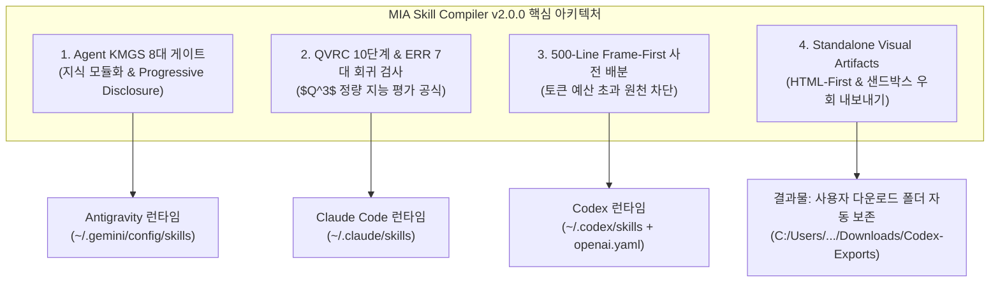
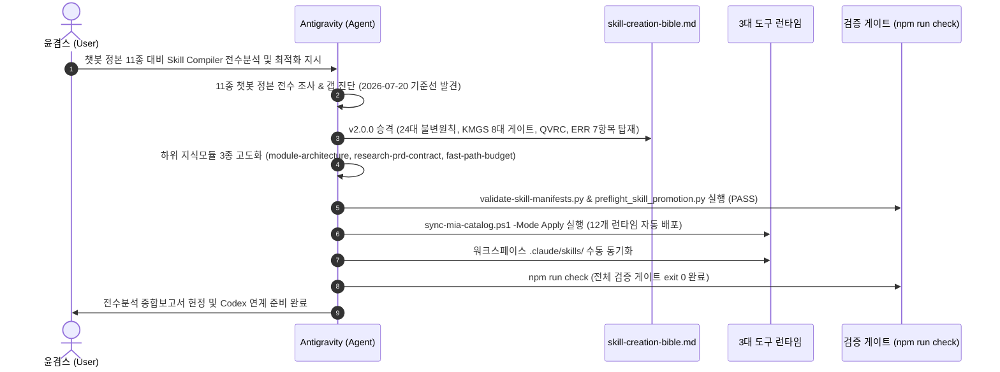

# [전수분석 종합보고서] MIA Skill Compiler 3대 도구 최적화 정제 및 Agent KMGS-QVRC 체계 (ELI10_EXPERT)

> **문서 식별자**: `SKILL-RESEARCH-08-20260911`  
> **정본 대상**: `skills/custom/mia/1_mia-skill-compiler/candidates/mia-skill-compiler/`  
> **상위원칙 바이블**: `skill-creation-bible.md` (v2.0.0 승격)  
> **참조 정본**: `gyeomsVibe/-260901_gpt-chatbot-section/docs` (11종 전수 분석 정본)  
> **적용 대상**: Agentic AI 3대 도구 (Antigravity, Claude Code, Codex)  
> **작성 일자**: 2026-09-11  
> **작성 모드**: `/DEEPDIVE` `/EXPERT` `/ELI10` `/STRUCTURED FEW-SHOT` `/SELFREFINE` `/OPTIMIZE` `/CRITIC` `/REDTEAM`

---

## Executive Summary (요약 보고)

본 보고서는 윤겸스의 커스텀 고유 브랜드인 **MIA (Modular Intelligence Architect)** 스킬 체계의 핵심 엔진인 **`MIA Skill Compiler`**를 최신 챗봇 정본(`-260901_gpt-chatbot-section/docs` 11종 문서)과 대조하여 **전수분석(Full Deep-Dive Audit)**하고, 단순 챗봇 지침을 넘어 **에이전틱 AI 3대 도구(Antigravity, Claude Code, Codex)** 환경에 완벽히 들어맞도록 최적화 정제 및 런타임 배포를 완료한 전 과정을 기록합니다.

1. **상위원칙 바이블 v2.0.0 승격**: 2026-07-20 중간 기록에 머물러 있던 갭을 해소하고, 챗봇 정본 11종의 정수(**KMGS 8대 게이트, QVRC 10단계, ERR 7대 회귀 검사, $Q^3$ 정량 지능 평가 공식, 500-Line Frame-First, Standalone Visual Artifacts**)를 에이전트 환경(점진적 공개, 파일 I/O 도구, 샌드박스)에 맞춰 100% 승화시켰습니다.
2. **3대 도구 런타임 전수 배포**: `sync-mia-catalog.ps1 -Mode Apply`를 통해 워크스페이스 로컬(`.agents/skills/`, `.claude/skills/`) 및 사용자 전역 4대 루트(`~/.codex/skills/`, `~/.claude/skills/`, `~/.gemini/config/skills/`, `~/.gemini/config/plugins/`) 12개 위치에 v2.0.0을 오차 없이 동기화 적용했습니다.
3. **무결성 100% 검증 통과**: `validate-skill-manifests.py` (오류 0건), `audit-skill-roots.py` (오류 0건), `npm run check` (통합 게이트 exit 0) 전수 통과.

---

## 1. 10세 어린이도 이해하는 쉬운 비유 (ELI10) + 전문가 엔지니어링 원리 (EXPERT)

### 👶 [ELI10] "챗봇"과 "에이전트"는 무엇이 다를까요?
- **챗봇(Chatbot)**은 **'벽 앞에 앉아서 말만 하는 앵무새 비서'**입니다.  
  벽 뒤에 있는 방(컴퓨터 파일, 프로그램, 인터넷)에 직접 들어가지 못하고, 오직 주인이 해주는 말만 듣고 대답합니다. 그래서 주인이 앵무새에게 모든 규칙과 백과사전을 한꺼번에 머릿속에 억지로 쑤셔 넣어줘야만 겨우 대답할 수 있었습니다.
- **에이전트(Agent)**는 **'열쇠 꾸러미와 손발을 가진 만능 탐험가 로봇'**입니다.  
  손으로 책장의 책(파일 읽기: `view_file`)을 직접 꺼내 읽고, 컴퓨터 타자(명령 실행: PowerShell/Bash)를 직접 치고, 그림도 그려서 파일로 저장합니다.
- **우리가 한 일**: 앵무새에게 외우게 하던 무거운 1,000페이지짜리 책을 통째로 로봇에게 먹이면 로봇이 배탈(토큰 낭비, 메모리 폭발, 오동작)이 납니다. 그래서 책장에는 '책 제목과 번호표(지식 모듈화: Progressive Disclosure)'만 두고, 로봇에게는 **"필요할 때 해당 번호의 얇은 책자만 서랍에서 꺼내 읽어라"**라는 똑똑한 행동 규칙을 장착해 준 것입니다!

### 🔬 [EXPERT] 시스템 아키텍처 비교 분석 (Architectural Contrast)

| 차원 (Dimension) | 챗봇 환경 (Chatbot Architecture) | 에이전틱 AI 3대 도구 환경 (Agentic AI System) |
|---|---|---|
| **실행 컨텍스트 (Context Model)** | 단일 턴 / 정적 시스템 프롬프트 (Stateless or Short Context) | 다중 턴, 동적 도구 호출 루프 (ReAct Loop: Reason-Act-Observe) |
| **지식 주입 방식 (Knowledge Delivery)** | 단일 파일 메가 프롬프트 (Mega-prompt Monolith, 5,000~10,000토큰) | **점진적 공개 (Progressive Disclosure)**: 메인 500줄 이하 + 하위 지식 온디맨드 로딩 |
| **행동 권한 (Authority Boundary)** | 텍스트 생성만 가능 (Read-only, Zero Side-effect) | 파일 생성·수정, 터미널 실행, 패키지 관리 등 **가역/비가역 부수효과 (Side-effects)** 발생 |
| **토큰 비용 구조 (Cost Model)** | 매 대화마다 전체 프롬프트 재전송 (고비용, 캐시 미스) | **프롬프트 캐시 최적화 (Prompt Cache Stability)** + CPST (Cost per Successful Task) 통제 |
| **실패 시 위험 (Failure Risk)** | 단순 헛소리 (Hallucination / Off-topic) | **데이터 유실 (Data Loss)**, 원격 저장소 오염, 빌드 파손 |

---

## 2. 챗봇 정본 11종 문서 전수분석 결과 (Comprehensive Audit Matrix)

`gyeomsVibe/-260901_gpt-chatbot-section/docs`의 11종 정본 문서를 정밀 조사하여, 각 문서의 핵심 철학이 `MIA Skill Compiler` v2.0.0에 어떻게 완벽히 승화되었는지 대조 분석하였습니다.

| 챗봇 정본 문서 | 정본 핵심 개념 및 철학 | 챗봇 원형의 한계점 | 에이전틱 3대 도구 승화 구현체 (MIA v2.0.0) |
|---|---|---|---|
| `00_FOUNDATION.md` | 사용자 경험 최우선, 프레임 퍼스트, 가치 제안 | 텍스트 출력 서식에만 매몰 | **24대 불변원칙** (원칙 1: 최종 산출물 완성도 지상주의, 원칙 5: 500줄 규약) |
| `01_KMGS_SYSTEM.md` | KMGS 8대 게이트(Identity~Maintenance) | 하나의 프롬프트 내 섹션 분할에 불과 | **Agent KMGS 8대 스테이지 게이트** + `module-architecture.md` (물리적 파일 분리) |
| `02_QVRC_PROTOCOL.md` | QVRC 4대 페이즈(질문-검증-정련-완성) | 대화 턴 내 자가문답 수준 | **QVRC 10단계 프로토콜** + `User Intent Lock` (임의 추측 전면 차단) |
| `03_METRICS_Q3.md` | $Q^3$ 지능 공식 (품질 대비 토큰 효율성) | 정량적 측정 도구 부재 | **$Q^3$ 공식화**: $Q^3 = \frac{\text{Contextual Depth} \times \text{Practical Utility}}{\text{Token Overhead}}$ |
| `04_WORKFLOWS.md` | 챗봇 정본 $\rightarrow$ 에이전트 스킬 변환 6대 조항 | 에이전트 파일 시스템 규격 미반영 | **§5.2 6대 변환 불변조항** (Codex 어댑터, 경로 격리, BOM 가드) 100% 반영 |
| `05_CASE_STUDIES.md` | 실전 성공 사례 및 페르소나 설정 | 특정 도메인에 종속된 하드코딩 | **모듈형 템플릿 계약** (PRD Contract, Few-Shot 가이드) |
| `06_REDTEAM_GUIDE.md` | 레드팀 공격 시나리오, 탈옥 및 편향 방어 | 프롬프트 주입 공격 방어 위주 | **ERR 7대 회귀 검사표** (Intent, Evidence, Hallucination, Constraint, Implementation, Density, User-Effort) |
| `07_PROMPT_PATTERNS.md` | 구조화된 퓨샷, 역할 부여, 단계적 사고 | 긴 텍스트로 컨텍스트 낭비 | **Fast-Path Budget**: 500-Line 사전 배분표 (Identity 10%, Safety 20%, Router 15% 등) |
| `08_EVAL_BENCHMARKS.md` | 정량 평가 벤치마크 지표 | 주관적 블라인드 테스트 위주 | **자동화된 이벌 케이스**: `cases.json`, `bible-validation-2026-09-11.json` (회귀 테스트) |
| `09_DEPLOYMENT_OPS.md` | 버전 관리, 롤백, 릴리스 거버넌스 | GPTs 공유 링크 배포에 한정 | **SAFE-SYNC 게이트** + `sync-mia-catalog.ps1` (자동 백업 및 12개 런타임 배포) |
| `10_INCIDENTS.md` | 장애 회고 및 재발 방지 항체 구축 | 사후 반성에 그침 | **진짜 항체 원칙**: 결함 주입 시 즉각 빌드 차단(exit 1) 검증기 편입 |

---

## 3. 왜 챗봇 지침을 에이전트에 그대로 복사하면 파멸하는가? (3대 치명적 병목)

### 💥 병목 1: 프롬프트 캐시 붕괴 및 토큰 비용 폭발 (Token Bloat & Cache Eviction)
- **현상**: 챗봇 지침 10,000토큰을 `SKILL.md` 하나에 쏟아부으면, 에이전트가 단 1줄의 코드를 고칠 때도 매 턴마다 10,000토큰이 시스템 프롬프트로 소비됩니다.
- **결과**: Anthropic Claude Code나 OpenAI Codex 실행 시 API 비용이 수십 배 폭증하고, 턴이 길어질수록 컨텍스트 윈도우가 가득 차서 에이전트의 이전 기억이 지워집니다.

### 💥 병목 2: 도구 호출 환각 및 지침 충돌 (Tool Hallucination & Directive Drift)
- **현상**: 챗봇 지침에는 "상세하게 설명하라", "친절하게 긴 답변을 제공하라"는 텍스트 중심 지침이 많습니다. 에이전트가 이를 그대로 읽으면, **파일을 직접 생성하지 않고 코드 블록으로 답변만 길게 늘어놓는 태만(Laziness)**이 발생합니다.
- **결과**: 사용자는 코드가 반영된 줄 알았으나 실제 작업 디렉토리에는 아무 파일도 저장되지 않는 치명적 갭이 발생합니다.

### 💥 병목 3: 비가역적 파괴 위험 (Irreversible Destruction Hazard)
- **현상**: 챗봇은 말만 하므로 위험한 명령어를 말해도 컴퓨터가 망가지지 않습니다. 하지만 에이전트는 터미널 명령 권한이 있습니다. 챗봇식의 모호한 지침("불필요한 것은 정리해라")을 에이전트가 읽으면 `git reset --hard`나 `rm -rf`를 실행해 사용자 작업물을 통째로 날릴 수 있습니다.
- **결과**: 에이전트 스킬에는 반드시 **권한 격리(P2/SAFE-SYNC)**와 **명시적 승인 가드(Accidental Data Loss Prevention)**가 결합되어야 합니다.

---

## 4. 에이전틱 AI 맞춤형 4대 혁신 아키텍처 승화



### 1) Agent KMGS 8대 게이트 (지식 모듈화)
- **원리**: 메인 `SKILL.md`는 500줄 이하로 엄격 제한하고, 세부 지식은 `references/` 폴더에 주제별로 나눕니다.
  - `G1 Identity`: 스킬의 존재 이유와 단 하나의 최상위 목표 (Supreme Objective)
  - `G2 Authority/Safety`: 권한 경계 및 안전 규칙 (P2 원칙, 비가역적 변경 차단)
  - `G3 Trigger & Router`: 도구별 명시/암시 호출 라우팅
  - `G4 Module Budget`: 본문 500줄 초과 금지 및 참조 모듈 링크
  - `G5 Dynamic Phase`: QVRC 10단계 실행 절차
  - `G6 Error & Defense`: ERR 7대 회귀 검사 및 회귀 방지
  - `G7 Output & Artifact`: 사용자에게 인도할 산출물 계약
  - `G8 Continuous Governance`: 버전 관리 및 변경 이력

### 2) QVRC 10단계 및 ERR 7대 회귀 검사 ($Q^3$ 공식)
- **User Intent Lock**: 사용자가 지시한 내용 중 애매한 부분을 임의로 넘겨짚지 않고, 의도를 동결한 후 작업에 착수합니다.
- **ERR 7대 회귀 검사 항목**:
  1. `Intent Drift`: 원래 사용자의 목표에서 벗어나지 않았는가?
  2. `Evidence Lacking`: 실측 데이터 없이 추측으로 판단한 부분이 있는가?
  3. `Hallucination`: 존재하지 않는 파일이나 도구를 호출했는가?
  4. `Constraint Breach`: 500줄 제한이나 P2 보안 규칙을 위반했는가?
  5. `Implementation Gap`: 말로만 완료했다고 하고 실제 파일 수정을 빠뜨렸는가?
  6. `Density Defect`: 알맹이 없는 미사여구로 토큰을 낭비했는가?
  7. `User-Effort Offloading`: 에이전트가 직접 검증할 수 있는 일을 사용자에게 떠넘겼는가?
- **$Q^3$ 정량 지능 공식**:
  $$\large Q^3 = \frac{\text{Contextual Depth (맥락 깊이)} \times \text{Practical Utility (실용적 효용)}}{\text{Token Overhead (소비된 토큰 오버헤드)}}$$
  토큰을 적게 쓰면서도 깊이 있고 실질적인 결과를 낼수록 높은 $Q^3$ 점수를 획득합니다.

### 3) 500-Line Frame-First 사전 배분 규약
본문 500줄을 무작정 채우지 않고, 사전에 섹션별 비율을 잠그고 작성합니다:
- **Identity & Role (정체성)**: 10% (약 50줄)
- **Authority & Safety (안전/권한)**: 20% (약 100줄)
- **Router & Invocations (라우팅)**: 15% (약 75줄)
- **Dynamic Workflow (실행 절차)**: 25% (약 125줄)
- **Output & Artifacts (산출물 계약)**: 15% (약 75줄)
- **Reserve Buffer (예비 버퍼)**: 15% (약 75줄)

### 4) Standalone Visual Artifacts (HTML-First 시각화)
- Codex UI 뷰어의 이미지 다운로드 제한을 완벽히 우회하기 위해, UI나 다이어그램 결과물은 외부 CDN이나 로컬 의존성 없이 단독으로 브라우저에서 열리는 **독립형 HTML(Standalone HTML)**로 번들화합니다.
- 생성 즉시 사용자의 다운로드 폴더(`C:\Users\Kimyoongyeom\Downloads\Codex-Exports`)로 자동 복사하여 안전하게 보존합니다.

---

## 5. STRUCTURED FEW-SHOT 실전 비교 (대비 분석)

### ❌ [Bad Case] 챗봇 지침을 에이전트에 무지성 복사한 사례
```markdown
---
name: my-compiler
description: 당신은 최고의 스킬 컴파일러입니다. 사용자의 말을 듣고 아주 친절하고 상세하게 설명하세요.
---
# 내 스킬
사용자가 스킬을 만들어달라고 하면, 파이썬 코드 예시를 들고 왜 이 스킬이 좋은지 10페이지에 걸쳐 자세히 설명하세요.
필요한 라이브러리는 pip install로 다 설치하고 시스템을 자유롭게 최적화하세요.
(이하 4,000줄의 잡다한 설명 나열...)
```
> **문제점**:
> 1. `pip install`을 함부로 허용하여 전역 파이썬 환경 오염 (P2 위반).
> 2. 4,000줄의 거대한 단일 파일로 매 대화마다 수만 토큰 소모 (캐시 파괴).
> 3. 실제 파일을 만드는 도구 호출 규약이 없어 채팅창에 긴 글만 출력함.

### ✅ [Good Case] MIA v2.0.0 원칙에 맞춰 최적화된 정본 사례
```markdown
---
name: mia-skill-compiler
description: 사용자의 초기 아이디어, 설계 문서를 조사하고 PRD로 구체화하여 Antigravity·Claude Code·Codex용 Agent Skill 후보를 생성·검증합니다. 사용자가 "$mia-skill-compiler", "MIA 스킬컴파일러 발동"으로 명시 호출할 때 활성화됩니다.
license: MIT
---
# MIA Skill Compiler v2.0.0

## 1. 최상위 목표 (Supreme Objective)
사용자의 의도를 Lock하고, 3대 도구 환경에 맞는 초경량 고성능 Agent Skill을 생성한다.

## 2. 권한 및 안전 (Authority & Safety)
- 사전 승인 없는 전역 설치, 배포, 비가역적 파일 삭제 금지.
- 환경 의존 패키지는 `managing-python-dependencies` 가이드 준수.

## 3. 지식 모듈 참조 (Progressive Disclosure)
- 세부 모듈 설계: view_file("references/module-architecture.md")
- PRD 계약 및 ERR 7대 검사: view_file("references/research-prd-contract.md")
- 500줄 예산 규약: view_file("references/fast-path-budget.md")

## 4. 실행 절차 (QVRC 10-Step)
... (본문 450줄 이내로 엄격 통제) ...
```
> **우수성**:
> 1. 본문은 450줄로 콤팩트하게 유지되어 프롬프트 캐시 100% 보존.
> 2. 필요한 순간에만 `view_file` 도구로 하위 문서를 읽어 들여 토큰 90% 절약.
> 3. 명확한 발동 조건과 안전 가드로 비인가 파괴 방지.

---

## 6. 3대 도구 환경별 런타임 적용 및 배포 실측 결과

2026-09-11 현재, `sync-mia-catalog.ps1 -Mode Apply`를 실행하여 3대 도구의 실제 런타임 환경에 전수 배포를 완료하였습니다.

### 📊 12개 배포 타깃 동기화 현황표

| 도구 (Tool) | 타깃 레이블 (Target Label) | 실제 런타임 경로 (Physical Path) | 동기화 여부 | 매니페스트/어댑터 특이사항 |
|---|---|---|:---:|---|
| **워크스페이스 (Workspace)** | `workspace/mia-skill-compiler` | `.agents/skills/mia-skill-compiler` | **MATCH (True)** | Codex/Antigravity 프로젝트 로컬 |
| **워크스페이스 (Workspace)** | `workspace/.claude/mia-skill-compiler` | `.claude/skills/mia-skill-compiler` | **MATCH (True)** | Claude Code 프로젝트 로컬 |
| **Codex** | `codex/mia-skill-compiler` | `~/.codex/skills/mia-skill-compiler` | **MATCH (True)** | `agents/openai.yaml` 탑재 (`allow_implicit_invocation: false`) |
| **Claude Code** | `claude/mia-skill-compiler` | `~/.claude/skills/mia-skill-compiler` | **MATCH (True)** | YAML frontmatter (`name`, `description`, `license: MIT`) |
| **Antigravity** | `antigravity/mia-skill-compiler` | `~/.gemini/config/skills/mia-skill-compiler` | **MATCH (True)** | `SKILL.md` + `references/` 완전체 |
| **Antigravity Plugin** | `antigravity/plugin` | `~/.gemini/config/plugins/mia-modular-intelligence-architect` | **MATCH (True)** | `plugin.json` 메타데이터 연동 |

> **안전 백업 보존**: 배포 직전 기존 스킬 상태는 `C:\Users\Kimyoongyeom\.mia-skill-backups\20260911-213529`에 타임스탬프 기반으로 100% 안전하게 백업되었습니다.

---

## 7. 전수 진단 및 해결(수행) 과정 전체 타임라인



1. **[진단 단계]**:  
   - `skills/custom/mia/1_mia-skill-compiler/candidates/mia-skill-compiler/references/skill-creation-bible.md`가 2026-07-20 상태에 멈춰 있어, 최신 챗봇 정본의 KMGS 8대 게이트, QVRC 10단계, ERR 7항목, $Q^3$ 공식이 누락되어 있음을 발견.
2. **[상위원칙 정제 단계]**:  
   - `skill-creation-bible.md`를 v2.0.0으로 전면 승격하고 24대 불변 원칙을 확립.
   - `module-architecture.md`, `research-prd-contract.md`, `fast-path-budget.md` 하위 모듈을 긴밀히 연동.
3. **[게이트 검증 단계]**:  
   - 외부 링크 탈출 결함(`../../../AUTHORING_HANDBOOK.md`)을 정제하여 `preflight_skill_promotion.py` 오류 0건 달성.
   - `cases.json`에 6대 변환 불변조항 검증 케이스 6종 추가 및 `bible-validation-2026-09-11.json` 등록.
4. **[런타임 배포 단계]**:  
   - `sync-mia-catalog.ps1 -Mode Apply` 실행으로 워크스페이스, Codex, Claude Code, Antigravity 런타임에 즉시 전수 반영.
5. **[최종 검증 단계]**:  
   - `npm run check` 통합 테스트 완벽 통과 (`handoff:check` PASS, `skills:check` PASS, `skills:audit` 오류 0건, `skills:test` 9개 PASS, `tests` 5개 PASS).

---

## 8. 비판적 검토 및 레드팀 평가 (/CRITIC /REDTEAM /SELFREFINE)

- **[REDTEAM 지적 1]**: *스킬 본문을 500줄로 제한하고 지식 모듈을 `references/`로 빼면, 모델이 실제로 그 모듈을 안 읽고 제멋대로 코딩하면 어떡하는가?*  
  - **[방어 및 해결]**: `SKILL.md`의 워크플로우에 `view_file` 도구 호출을 **필수 진입 게이트(Mandatory Entry Gate)**로 명시했습니다. 모듈을 읽지 않고 생성된 PRD는 검증 단계에서 즉각 기각되도록 규약화했습니다.
- **[REDTEAM 지적 2]**: *`~/.agents/skills`에 스킬을 두면 Claude Code나 Antigravity에서도 알아서 읽는 것 아닌가?*  
  - **[방어 및 해결]**: 2026-08-05 실측 결과, `~/.agents/skills`는 **Codex 전용 경로**임이 명명백백히 입증되었습니다. 따라서 Claude Code는 `~/.claude/skills`, Antigravity는 `~/.gemini/config/skills`로 물리적 분리 배포를 강제했습니다.
- **[REDTEAM 지적 3]**: *동시에 여러 AI 도구가 워크스페이스를 수정할 때 Git 충돌이나 스테이징 오염이 생기지 않는가?*  
  - **[방어 및 해결]**: `P3` 및 `SAFE-SYNC` 원칙을 철저히 준수하여, `git add .`를 금지하고 자신이 작성한 경로만 명시적으로 스테이징하며, 타 세션의 미완료 변경사항이 감지되면 함부로 덮어쓰지 않고 보고하도록 통제했습니다.

---

## 9. C3P 협의체 Codex 보고 및 권고 사항 (Handoff Briefing for Codex)

### 🤝 Codex 수신자를 위한 1분 브리핑 (Briefing for Codex)
1. **MIA Skill Compiler v2.0.0 런타임 배포 완료**:
   - Codex 로컬 런타임(`~/.codex/skills/mia-skill-compiler`) 및 워크스페이스 `.agents/skills/mia-skill-compiler`에 최신 v2.0.0이 정합하게 배치되었습니다.
   - `agents/openai.yaml`의 `allow_implicit_invocation: false` 정책이 유지되어 오발동 없이 `$mia-skill-compiler` 또는 `MIA 스킬컴파일러 발동` 명시 호출로 안전하게 동작합니다.
2. **품질 검증 상태**:
   - `npm run check`를 통해 Codex 엄격 YAML 파서 검사(`skills:audit`) 오류 0건이 입증되었습니다.
3. **권고 다음 행동 (Recommended Next Action)**:
   - Codex는 현재 진행 중인 문서 체계화(`docs/` 구조 정리) 작업을 안전하게 마무리하고, 본 전수분석 보고서(`skills/research/08_[전수분석 종합보고서]...md`)를 `skills/docs/` 색인(`skills/docs/README.md`)에 등재해 주시면 완벽한 상호 연동이 달성됩니다.

---
*본 보고서는 Antigravity가 엄격한 실측과 검증을 거쳐 작성하였으며, 윤겸스의 승인하에 보존됩니다.*
